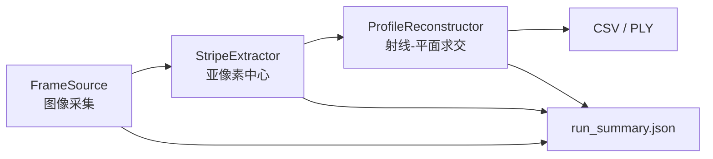

# 线激光静态扫描头最小工程

本工程依据 `final/08线激光静态扫描头研发计划与验收标准.md` 搭建，目标是先固定数据契约和流水线边界，便于后续逐个迁入相机采集、激光条纹提取、标定和点云转换代码。

当前版本只提供可运行的合成数据闭环，不是计量验收程序。`calibration/demo.json` 是演示参数，禁止用于真实测量。

## 快速运行

无需安装工程，PowerShell 中执行：

```powershell
$env:PYTHONPATH="$PWD\src"
python -m line_laser_static --config configs/demo.json
python -m unittest discover -s tests -v
```

运行结果写入 `outputs/demo/<运行编号>/`，包含 CSV、PLY 和 `run_summary.json`。

## 代码流程



图例：`FrameSource`、`StripeExtractor`、`ProfileReconstructor` 是三个稳定替换点；数据模型和输出字段是模块间契约。

## 目录说明

```text
calibration/                 标定文件；演示文件与真实标定必须区分
configs/                     单次运行配置
data/raw/calibration/        相机和激光平面标定原始数据
data/raw/tuning/             调参数据
data/raw/validation/         正式验证数据
data/raw/blind_test/         盲测数据
data/metadata/               实验元数据
outputs/                     CSV、PLY 和运行摘要
references/legacy_0324/      旧工程算法参考副本；不进入默认运行链路
src/line_laser_static/       工程代码
tests/                       最小闭环测试
reports/                     设计和变更说明
```

## 迁入旧代码

建议按以下顺序逐段替换，每次替换后先运行测试和一组固定原始图像：

1. 相机采集：新增类实现 `FrameSource.capture() -> Frame`，在 `bootstrap.py` 中增加对应配置分支。厂商 SDK 的打开、关闭和异常处理留在适配器内部。
2. 条纹提取：把旧算法封装为 `StripeExtractor.extract(Frame) -> StripeProfile`。输出必须保留逐点 `intensity`、`confidence` 和 `valid`。
3. 三维转换：把旧标定/重建代码封装为 `ProfileReconstructor.reconstruct(StripeProfile) -> PointCloud`。坐标统一为毫米，无效坐标写 `NaN` 且 `valid=False`。
4. 真实配置：复制 `configs/demo.json` 和 `calibration/demo.json` 后改名，写入真实硬件、机械配置和唯一标定版本；不要覆盖演示文件。

## 旧工程参考代码

已将 G:/dev/projects/0324line_3d 中两条经过旧数据验证的链路原样复制到
<code>references/legacy_0324/</code>：

- 激光平面标定：<code>laser_plane_calibration.py</code>，以及
  <code>laser_stripe_subpixel_module_v2.py</code>、<code>src/red_filter_preprocess_v3_reusable.py</code>。
- ROI 中心线与单帧点云：<code>ablation_v1_runner.py</code> 中的
  <code>LaserLineExtractorROI</code>，底层为 <code>src/linelaser0319_reusable.py</code>。
- 批量入口：<code>export_v1_roi_centerline_batch.py</code>。

详细来源、哈希、适配限制和使用顺序见
[参考代码说明](references/legacy_0324/README.md)。原始复用分析来自
G:/dev/projects/0514_ruanzhu/新线激光系统可复用代码分析.md。

参考副本刻意不包含旧设备 config_plane_* 配置，因此不能直接作为新设备默认入口。
完成新相机内参后，应使用新的 K/D 和新采集的标定图像生成激光平面；不得沿用副本中的
默认内参、畸变、激光平面、机器人安装参数、ROI、阈值和 flip_robot_y。

新设备是 450 nm 蓝光配黑白相机，旧代码的 R-G/红光增强预处理不能直接用于 Mono8
图像。建议保留 ROI、Steger 亚像素中心和射线-平面求交，仅把预处理替换为黑白强度或
暗场差分。若同一批新图像上的有效率、断线、重复性和三维误差达到验收门槛，就没有必要
重新设计整套条纹提取算法。

Windows 下安装参考代码所需的可选依赖：

~~~powershell
python -m pip install -e ".[legacy-reference]"
~~~

参考副本不会随 line-laser-static 默认 CLI 导入，所以核心最小工程仍只依赖 NumPy。

## 当前边界

- 已有：单帧输入、亚像素重心示例、射线-平面重建、固定结果字段、运行追溯摘要、合成闭环测试。
- 已归档待适配：旧激光平面标定、ROI/Steger 中心线、射线-平面求交和批量导出参考代码。
- 待实现：大恒 SDK、黑白图暗场/背景差分、真实相机内参标定、参考代码薄适配和验收指标计算。
- 不在本阶段：俯仰运动、编码器同步、多轮廓融合、机器人手眼标定、产品化 C++ 实时软件。
