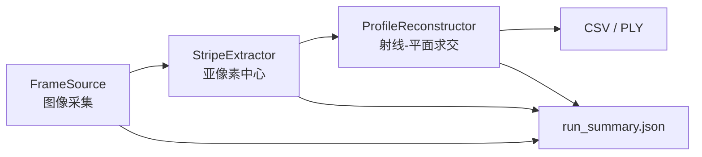

# 线激光静态扫描头最小工程

本工程依据 `final/08线激光静态扫描头研发计划与验收标准.md` 搭建，目标是先固定数据契约和流水线边界，便于后续逐个迁入相机采集、激光条纹提取、标定和点云转换代码。

当前版本只提供可运行的合成数据闭环，不是计量验收程序。`calibration/demo.json` 是演示参数，禁止用于真实测量。

## 快速运行

无需安装工程，PowerShell 中执行：

```powershell
$env:PYTHONPATH="$PWD\src"
python -m line_laser_static --config configs/demo.json
python -m unittest discover -s tests -v
```

运行结果写入 `outputs/demo/<运行编号>/`，包含 CSV、PLY 和 `run_summary.json`。

## 代码流程



图例：`FrameSource`、`StripeExtractor`、`ProfileReconstructor` 是三个稳定替换点；数据模型和输出字段是模块间契约。

## 目录说明

```text
calibration/                 标定文件；演示文件与真实标定必须区分
configs/                     单次运行配置
data/raw/calibration/        相机和激光平面标定原始数据
data/raw/tuning/             调参数据
data/raw/validation/         正式验证数据
data/raw/blind_test/         盲测数据
data/metadata/               实验元数据
outputs/                     CSV、PLY 和运行摘要
src/line_laser_static/       工程代码
tests/                       最小闭环测试
reports/                     设计和变更说明
```

## 迁入旧代码

建议按以下顺序逐段替换，每次替换后先运行测试和一组固定原始图像：

1. 相机采集：新增类实现 `FrameSource.capture() -> Frame`，在 `bootstrap.py` 中增加对应配置分支。厂商 SDK 的打开、关闭和异常处理留在适配器内部。
2. 条纹提取：把旧算法封装为 `StripeExtractor.extract(Frame) -> StripeProfile`。输出必须保留逐点 `intensity`、`confidence` 和 `valid`。
3. 三维转换：把旧标定/重建代码封装为 `ProfileReconstructor.reconstruct(StripeProfile) -> PointCloud`。坐标统一为毫米，无效坐标写 `NaN` 且 `valid=False`。
4. 真实配置：复制 `configs/demo.json` 和 `calibration/demo.json` 后改名，写入真实硬件、机械配置和唯一标定版本；不要覆盖演示文件。

如果旧算法依赖 OpenCV，再按其实际版本单独加入依赖；当前骨架故意只依赖 NumPy。

## 当前边界

- 已有：单帧输入、亚像素重心示例、射线-平面重建、固定结果字段、运行追溯摘要、合成闭环测试。
- 待迁入：大恒 SDK、暗场/ROI/连通性处理、真实畸变校正、相机内参标定、激光平面标定、验收指标计算。
- 不在本阶段：俯仰运动、编码器同步、多轮廓融合、机器人手眼标定、产品化 C++ 实时软件。
