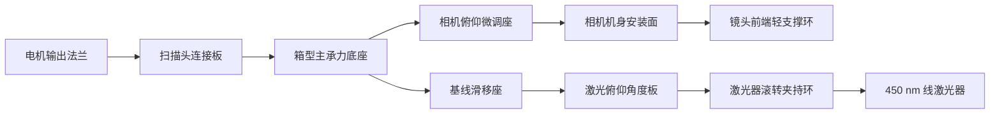

# 线激光扫描头支架结构建议续稿

日期：2026-07-06

## 1. 当前设计输入

本轮补充后的关键变化是：俯仰扫描电机带着“相机 + 镜头 + 滤光片 + 激光器 + 刚性支架”整体转动。这样一来，相机与激光器的联合外参在扫描过程中可以保持为刚体常量，但支架设计必须同时控制三件事：

1. 相机-激光器之间的相对刚度。
2. 整个扫描头绕俯仰电机轴的转动惯量。
3. 电机转轴、扫描头质心、相机光心之间的空间关系。

已有参数：

| 项目 | 参数 |
|---|---|
| 相机 | 大恒 ME2P-1230-23U3M，约 36 mm x 31 mm x 38.8 mm，约 66 g |
| 镜头 | 大恒 HN-P-2524-20M-C1.1/1，25 mm，约 Phi40 mm x 58.44 mm，约 164 g |
| 激光器 | 450 nm，30 deg 扇角，1 m 处线长约 536 mm |
| 激光器现有支架 | 垂直高度约 100 mm，底盘直径 80 mm，3 孔间距 62 mm，安装孔 Phi3.75 mm，夹持圈 Phi16.5 mm，约 0.12 kg |
| 目标工作距离 | 约 1 m |
| 目标视场 | 约 0.5 m x 0.5 m |
| 当前基线设想 | 120-220 mm 可调 |

## 2. 方案结论

推荐采用“紧凑一体式箱型主架 + 可锁紧相机座 + 可锁紧激光器分体夹持座”的方案。

不建议把激光器自带的 100 mm 万向支架直接固定到机器人末端扫描头上。它适合实验台调光，但对机器人末端整体俯仰扫描来说，问题比较明显：

- 高度 100 mm 会显著增加转动惯量和振动放大；
- 万向节点和细长立柱会降低激光平面稳定性；
- 底盘直径 80 mm 会占用空间，导致扫描头更宽、更重；
- 锁紧后抗冲击和抗重复启停能力不如 CNC 分体夹持座。

建议把自带支架当作“激光器直径、夹持方式、初始调试姿态”的参考，正式结构改为短悬臂、双螺钉锁紧、带定位面的激光器座。

## 3. 光路方案建议

在你当前目标下，更合适的是“同侧斜射三角测量”：

- 相机光轴尽量接近工作面法向；
- 激光器布置在相机一侧；
- 激光平面穿过相机视场中心附近；
- 扫描电机带整个刚性头俯仰，扫描过程中相机-激光外参不变。

不优先推荐反射镜式方案。反射镜会增加标定变量和装配误差，对第一版样机不划算。

基线建议：

| 基线 | 1 m 工作距离下对应几何夹角约值 | 评价 |
|---:|---:|---|
| 120 mm | 6.8 deg | 紧凑、遮挡少，但深度灵敏度偏低 |
| 160 mm | 9.1 deg | 兼顾紧凑和可用灵敏度 |
| 180 mm | 10.2 deg | 推荐初始值 |
| 220 mm | 12.4 deg | 推荐调试上限，深度灵敏度更好 |
| 268 mm | 15.0 deg | 若追求更强三角测量灵敏度，需要放宽当前基线范围 |

因此第一版建议保留 120-220 mm 调节槽，但实际调试优先从 180-220 mm 开始。若后续发现 Z 向噪声较大、遮挡又不严重，第二版可以把最大基线放宽到 260-280 mm。

## 4. 总体结构示意图

### 4.1 俯视示意

```text
工作面方向 / Z
      ^
      |
      |        激光平面打到相机视场中心
      |
      |     / 激光器 Phi16.5 分体夹持座
      |    /
      |   /  激光俯仰角调节板
      |  /
      | [激光座]==== 基线滑移槽 120-220 mm ==== [相机座]
      |      \                                 [相机+镜头]
      |       \____________________________________|
      |
      +------------------------------> X / 基线方向

建议初始基线：180-220 mm
建议相机：近似正视工作面
建议激光器：侧向斜射，调到激光线位于相机视场中央
```

### 4.2 侧视示意

```text
               相机 + 镜头 + 滤光片
                    |
              [相机俯仰微调板]
                    |
        =================================
        |      CNC 箱型主承力底座       |
        =================================
          /                           \
     三角加强筋                   三角加强筋
        \                           /
         ======= 电机转轴连接板 =======
                    O
              俯仰扫描电机轴

设计重点：
1. 电机轴尽量靠近扫描头整体质心。
2. 相机光心尽量靠近电机轴，或者至少明确偏置量并在标定中建模。
3. 相机座、激光座最终锁紧后用定位销固化。
```

### 4.3 结构流程图



## 5. 相机支架设计

推荐做成“三点约束 + 可锁紧俯仰板 + 镜头轻支撑”的结构。

### 5.1 相机安装基准

- 以相机机身侧面或底面作为主定位面；
- 用相机自带 M3 孔固定；
- 至少 2 颗螺钉固定，最好 4 颗；
- 增加 1 个平面定位台阶，避免完全靠螺钉摩擦抗剪；
- 如果相机机械尺寸允许，后续第二版增加 2 个钻铰定位销孔。

### 5.2 相机俯仰微调

第一版保留小范围俯仰调节即可：

- 调节范围：建议 +/- 5 deg，最多 +/- 10 deg；
- 结构形式：中心转轴孔 + 双弧形槽；
- 锁紧方式：2 颗 M4 或 M5 锁紧螺钉；
- 调好后：补钻铰定位销，或者第二版改为固定角度块。

### 5.3 镜头支撑

镜头约 164 g，长度约 58.44 mm，加滤光片后前端悬臂更长。建议增加镜头前端轻支撑环：

- 支撑环内径略大于镜头外径，留 0.1-0.3 mm 装配余量；
- 用开口环或软垫轻夹，不要把镜头当作主承力件强行夹死；
- 支撑环固定在相机座同一刚性结构上，避免相机和镜头受到相对扭曲；
- 支撑环主要用于抗振，不用于调整光轴。

## 6. 激光器支架设计

推荐放弃现有 100 mm 高万向支架作为正式上机结构，改为短结构的“三自由度可调激光座”。

### 6.1 自由度分配

| 自由度 | 推荐实现方式 | 推荐范围 |
|---|---|---|
| 基线距离 | 主底座长圆孔 / 燕尾滑槽 / T 槽滑块 | 120-220 mm |
| 激光俯仰角 | 圆心转轴 + 弧形槽锁紧板 | 10-25 deg |
| 激光滚转角 | Phi16.5 分体夹持环绕激光轴旋转 | +/- 10 deg |

不建议使用球头万向节作为最终锁紧结构。它调起来方便，但锁紧后的重复性和抗振性较差。

### 6.2 激光夹持环

- 按激光器外径设计分体式夹持环，当前可按 Phi16.5 mm 预留；
- 夹持长度建议不小于 25-35 mm；
- 使用 2 颗 M3 或 M4 夹紧螺钉；
- 夹持环外侧做角度刻线，便于调整激光线滚转；
- 夹持座底部做定位平面，锁紧后不允许单点受力。

### 6.3 激光器高度

激光器出光中心高度应尽量与相机光心高度接近，避免支架出现高耸结构。可接受的做法：

- 主底座上做低矮立板；
- 激光夹持环直接固定在立板上；
- 立板两侧加三角筋；
- 激光器线缆从后侧或侧后方固定，避免线缆拖拽改变激光角度。

## 7. 电机扫描轴与质心

因为电机会带整个刚性头转，电机轴位置比普通静态支架更关键。

建议：

1. 电机轴尽量穿过扫描头整体质心，降低启停振动和负载力矩。
2. 相机光心尽量靠近电机轴，减少扫描时相机光心绕轴公转造成的位姿变化。
3. 如果两者不能兼顾，优先保证质心靠近电机轴；相机光心偏置可以通过标定建模。
4. 电机连接板上预留前后 +/- 15-20 mm 的调节孔位，用于实际配重调试。
5. 线缆必须做软环和应力释放，不能让 USB3.0 线、激光电源线成为额外弹簧。

## 8. CNC 建模建议

第一版建议分件加工，便于迭代：

| 零件 | 建议材料 | 说明 |
|---|---|---|
| 主承力底座 | 6061-T6，厚 12-15 mm | 箱型或厚板加筋结构 |
| 相机俯仰板 | 6061-T6，厚 8-10 mm | 中心转轴 + 弧形槽 |
| 镜头支撑环 | 6061-T6 或 POM 衬套 | 轻支撑，不强夹 |
| 激光基线滑块 | 6061-T6，厚 8-12 mm | 长槽锁紧 |
| 激光角度板 | 6061-T6，厚 6-8 mm | 弧形槽调俯仰 |
| 激光分体夹持环 | 6061-T6，或铝件内衬软垫 | 夹持 Phi16.5 mm |

工程图需要输出：

- STEP 三维模型；
- PDF 工程图；
- 孔位、螺纹、沉孔、销孔、公差；
- 相机光轴、激光平面、基线、工作距离标注；
- BOM 和装配爆炸图。

## 9. 推荐第一版尺寸策略

建议第一版不要追求极限轻量化，先追求调试可靠：

- 主底座厚度：12 mm 起步；
- 相机座俯仰范围：+/- 5 deg；
- 激光俯仰范围：10-25 deg；
- 激光滚转范围：+/- 10 deg；
- 基线范围：120-220 mm；
- 推荐初始基线：180 mm；
- 若电机扭矩余量足够，优先测试 200-220 mm；
- 所有长槽调节完成后，使用定位销或第二版固定角度件固化。

## 10. 待确认参数

进入 CAD 前还需要确认：

1. 俯仰电机型号、额定/峰值扭矩、允许负载惯量。
2. 电机输出法兰孔位和中心定位方式。
3. 期望俯仰扫描角度范围和最大角速度/加速度。
4. 激光器本体的准确外径、长度、出光口到夹持位置距离。
5. 相机机身可用安装面和实际孔位图。
6. 机器人末端允许的扫描头最大宽度、高度、重量。
7. 是否需要激光安全罩、防尘罩、碰撞保护边界。

