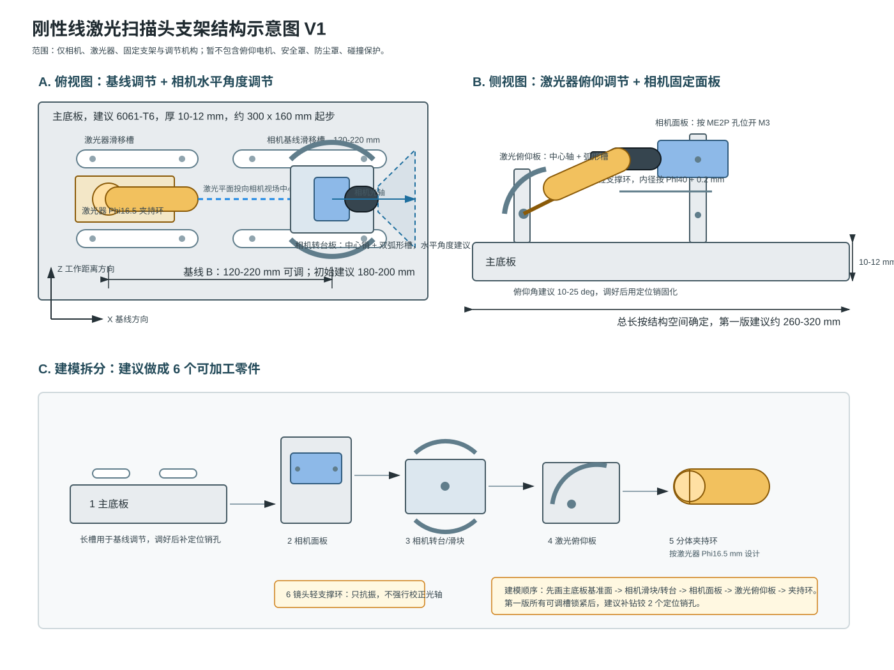

# 刚性线激光扫描头支架建模说明

日期：2026-07-06

## 1. 是否可以参照你给的结构图

可以参照。你给的参考图适合借鉴三个点：

1. 相机先安装到独立面板，再把面板安装到外部支架。
2. 通过长圆孔实现有限范围调节。
3. 调好后通过多颗螺钉锁紧，而不是只靠单点夹紧。

但需要做一个重要改变：你的对象不是静态读卡器，而是线激光三角测量头。相机与激光器之间的外参稳定性比安装便利性更重要，所以建议用一块厚主底板把相机座和激光器座统一成一个刚体。

本轮不考虑俯仰电机、安全罩、防尘罩和碰撞保护。

## 2. 推荐结构

推荐采用：

```text
主底板
  ├─ 相机基线滑块
  │   ├─ 相机水平角度转台
  │   └─ 相机安装面板
  │       └─ 镜头轻支撑环
  └─ 激光器滑块
      └─ 激光器俯仰调节板
          └─ Phi16.5 分体夹持环
```

对应示意图见：



## 3. 建议坐标系

为了方便三维建模，建议先定义坐标：

- X：相机与激光器的基线方向。
- Y：激光线长度方向。
- Z：工作距离方向，即相机看向工件的方向。

主底板位于 X-Y 平面，相机和激光器都安装在主底板上方。工作面位于 +Z 方向。

## 4. 主底板

建议第一版主底板按厚板加工：

| 项目 | 建议值 |
|---|---|
| 材料 | 6061-T6 铝合金 |
| 厚度 | 10-12 mm |
| 外形 | 约 260-320 mm x 130-180 mm，按最终包络调整 |
| 表面 | 阳极氧化或本色即可 |
| 安装孔 | 长圆孔 + 预留定位销孔 |

主底板上建议布置两组长圆孔：

1. 激光器座滑移槽：用于调整激光器相对相机的基线位置。
2. 相机座滑移槽：用于调整相机安装位置和基线。

调试完成后，不建议长期只靠长圆孔摩擦锁紧。建议补钻铰定位销孔，或者第二版改为固定孔位。

## 5. 相机支架部分

相机部分建议分成三层：

```text
相机机身
  ↓
相机安装面板
  ↓
相机水平角度转台
  ↓
相机基线滑块
  ↓
主底板
```

### 5.1 相机安装面板

- 按 `ME2P-1230-23U3M机械尺寸.png` 的安装孔位开孔。
- 相机外形可按约 `36 mm x 31 mm x 38.8 mm` 先建包络。
- 面板厚度建议 6-8 mm。
- 面板上做相机定位台阶，避免只靠螺钉抗剪。

### 5.2 相机水平角度转台

作用是调节相机光轴与基线之间的夹角，也就是你说的“基线角度”。

推荐结构：

- 中心一个圆柱销/转轴孔；
- 两侧双弧形槽；
- 调节范围先做 `±5°`，最多 `±8°`；
- 两颗 M4 螺钉锁紧；
- 角度调好后补定位销。

不建议第一版做太大的相机角度范围。相机角度变化太大，会让视场中心、畸变有效区域和标定板摆放都变复杂。

### 5.3 镜头轻支撑环

镜头约 `Phi40 mm x 58.44 mm`，加滤光片后前端悬臂会变长。建议加一个轻支撑环：

- 内径按 `Phi40 + 0.2 mm` 起步；
- 支撑环可以做开口式，内侧贴薄软垫；
- 只用于抗振，不用于强行矫正光轴；
- 支撑环和相机面板应固定到同一刚性结构上。

## 6. 激光器支架部分

激光器部分建议分成三层：

```text
450 nm 激光器
  ↓
Phi16.5 分体夹持环
  ↓
激光器俯仰调节板
  ↓
激光器滑块
  ↓
主底板
```

### 6.1 激光器夹持环

按你文档中的夹持圈 `Phi16.5 mm` 先设计：

- 分体夹持环，夹持长度建议 25-35 mm；
- 2 颗 M3 或 M4 夹紧螺钉；
- 激光器可绕自身轴小范围滚转，用于调节激光线水平度；
- 夹持环外侧可加角度刻线。

### 6.2 激光器俯仰调节板

推荐结构：

- 一个中心转轴孔；
- 两个弧形槽；
- 调节范围建议 `10-25°`；
- 双螺钉锁紧；
- 两侧加三角筋或加厚侧板。

这里不建议继续使用激光器自带的 100 mm 高万向支架。它调试方便，但上到机器人末端后会明显降低抗振和重复性。

### 6.3 激光器滑块

激光器滑块通过主底板长槽实现基线调节。第一版建议：

- 基线范围保留 `120-220 mm`；
- 初始建模按 `180-200 mm` 放置；
- 如果空间允许，主底板可以预留到 `240 mm`，方便后续试验。

## 7. 第一版尺寸建议

| 项目 | 建议 |
|---|---|
| 主底板厚度 | 10-12 mm |
| 相机面板厚度 | 6-8 mm |
| 激光俯仰板厚度 | 6-8 mm |
| 相机水平角度 | ±5°，最多 ±8° |
| 激光俯仰角 | 10-25° |
| 激光滚转角 | ±10° |
| 基线范围 | 120-220 mm |
| 初始基线 | 180-200 mm |

## 8. 三维建模顺序

1. 建主底板，先画外形、厚度、两组长圆孔。
2. 建相机滑块，和主底板用螺钉/长槽连接。
3. 建相机水平角度转台，中心孔 + 双弧形槽。
4. 建相机安装面板，按相机尺寸图开孔。
5. 建镜头轻支撑环，先按 `Phi40 + 0.2 mm`。
6. 建激光器滑块和俯仰调节板。
7. 建 `Phi16.5 mm` 分体夹持环。
8. 装配后检查相机视场、激光平面、基线、螺钉可达性。

## 9. 需要从尺寸图中精确替换的参数

后续 CAD 里不要只用示意值，需从以下图纸精确替换：

- `ME2P-1230-23U3M机械尺寸.png`：相机安装孔位置、孔径、可用安装面。
- `450 nm激光器机械尺寸.png`：激光器本体外径、长度、出光口位置、夹持区域长度。
- 镜头 datasheet：镜头外径 `Phi40`、长度、滤光片安装后的总长。

## 10. 建模注意点

- 所有调节自由度都要能锁紧，且最好是双螺钉锁紧。
- 长槽只用于第一版调试，不建议作为最终长期定位方式。
- 相机与镜头不要被两个不共线的结构强行过约束。
- 激光器线缆需要留出自然弯曲半径，避免线缆拖动改变角度。
- 主底板尽量做短、宽、厚，不做细长悬臂。

