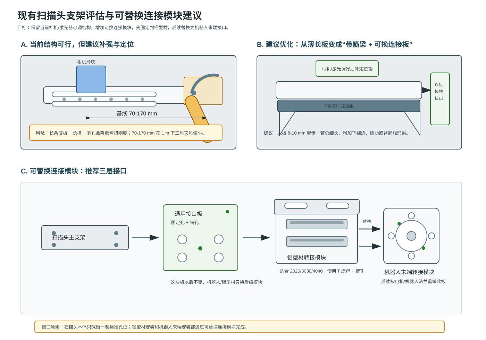

# 现有扫描头支架评估与连接模块建议

日期：2026-07-07

## 1. 结构可行性结论

你现在这版结构可以用于初步实验，尤其适合验证：

- 相机与激光器能否完成联合标定；
- 激光器倾角范围是否足够；
- 相机与激光器基线变化对光条成像和三维重建的影响；
- 1 m 工作距离下，线激光是否能稳定覆盖目标区域。

但它更像第一版实验支架，不建议直接作为机器人末端最终结构。主要原因是：主支架是细长板，长槽和多排圆孔会削弱弯扭刚度；相机和激光器都挂在长板上，调节自由度多，锁紧后的重复性需要加强。

## 2. 当前结构的主要风险

### 2.1 基线 70-170 mm 偏小

如果相机近似正视工作面，工作距离约 1 m，则不同基线对应的三角夹角约为：

| 基线 | 1 m 工作距离下夹角约值 |
|---:|---:|
| 70 mm | 4.0 deg |
| 100 mm | 5.7 deg |
| 120 mm | 6.8 deg |
| 150 mm | 8.5 deg |
| 170 mm | 9.6 deg |
| 200 mm | 11.3 deg |

70-170 mm 可以先做实验，但 Z 向灵敏度会偏弱。建议：

- 初始实验优先使用 150-170 mm；
- 如果结构空间允许，把上限放宽到 200-220 mm；
- 如果必须保持 70-170 mm，就尽量提升光条中心提取精度，并降低机械振动。

### 2.2 长条主板抗扭刚度不足

当前主板较长，且开了两条长槽和多排圆孔。这样便于调节，但会降低抗弯和抗扭刚度。

优化建议：

- 主板厚度建议 8-10 mm 起步；如果只有 5-6 mm，建议加下翻边或背部加强梁；
- 在主板背面增加一条矩形加强梁，例如 20 x 20 或 20 x 30 铝型材/铝条；
- 激光器端和相机端各加一块三角筋板；
- 不必要的圆孔少开，或者分区开孔，避免在受力路径上密集开孔。

### 2.3 激光器圆弧槽建议改成“中心转轴 + 双弧槽”

从图中看，激光器依靠圆弧槽调节倾角。这个思路是对的，但最好满足：

- 有一个明确的中心转轴孔；
- 弧形槽至少两处锁紧，避免单点锁紧后受振转动；
- 激光器夹持环本身允许绕激光轴小范围滚转，用于调激光线水平度；
- 调好后补一个定位销孔，或者第二版固定角度。

### 2.4 相机直槽调基线需要防止偏摆

相机通过直槽调基线是合理的，但要避免滑块在槽里发生微小偏摆。

优化建议：

- 相机滑块至少用 4 颗螺钉锁紧；
- 两条平行长槽比一条长槽更可靠；
- 滑块底部做一条定位台阶或导向边；
- 调好后增加 2 个定位销孔；
- 相机面板和滑块之间尽量用面接触，不要靠悬臂小块连接。

## 3. M3/M4 通孔尺寸是否合适

你的设置基本合理：

| 螺钉 | 你设置的通孔 | 评价 |
|---|---:|---|
| M3 | 3.3 mm | 可以，属于偏紧的普通间隙孔 |
| M4 | 4.5 mm | 合适，常用普通间隙孔 |

更细一点说：

- M3 如果是普通圆孔，3.3 mm 可以；如果 CNC 加工、装配公差较大，建议 3.4 mm；
- M3 如果是长槽，槽宽建议 3.6-4.0 mm，并配垫圈；
- M4 普通通孔用 4.5 mm 合适；
- M4 长槽槽宽建议 5.0 mm 左右，并配大垫圈或压板；
- 如果是沉头螺钉，需要按螺钉头部另开沉孔/沉头，不要只按通孔考虑；
- 如果是铝件攻丝孔，不是通孔：M3 底孔通常约 2.5 mm，M4 底孔通常约 3.3 mm。

第一版实验件建议用圆柱头内六角螺钉 + 平垫圈，比沉头螺钉更适合反复调节。沉头螺钉会自动找锥面中心，不利于细微调节。

## 4. 建议增加的连接模块

你现在还没有确定机器人末端，所以建议采用“三层接口”：

```text
扫描头主支架
  ↓
通用接口板：以后尽量不变
  ↓
可替换连接模块
  ├─ 铝型材转接模块：当前实验用
  └─ 机器人末端转接模块：后续替换
```

对应示意图：



## 5. 通用接口板怎么设计

通用接口板建议固定在扫描头主板背面或下方，作为扫描头的标准接口。

建议参数：

| 项目 | 建议 |
|---|---|
| 材料 | 6061-T6 |
| 厚度 | 8-10 mm |
| 与扫描头连接 | 4 x M4 通孔或螺纹孔 |
| 定位 | 2 个定位销孔，建议 Phi4H7 或 Phi5H7 |
| 接口形状 | 矩形板，避免复杂异形 |
| 安装方向 | 尽量靠近扫描头质心 |

通用接口板上建议保留：

- 4 个固定孔；
- 2 个定位销孔；
- 1 个中心参考孔或中心刻线；
- 若空间允许，预留一组备用孔距。

## 6. 铝型材转接模块怎么设计

当前实验阶段，建议做一个铝型材转接模块，用于安装到 2020、3030 或 4040 铝型材。

推荐形式：

### 方案 A：平板 + T 型螺母

适合快速实验。

- 一块 8-10 mm 厚铝板；
- 板上开两条长槽；
- 用 T 型螺母固定到铝型材槽内；
- 另一面用固定孔 + 定位销连接通用接口板。

优点是简单、可调。缺点是抗扭刚度一般。

### 方案 B：L 型转接座

更推荐。

- 水平面连接铝型材；
- 竖直面连接扫描头通用接口板；
- 两侧加三角筋；
- 可以让相机离型材有一定高度，便于调整 1 m 工作距离。

优点是刚度更好，也更像后续机器人末端安装状态。

### 方案 C：U 型抱夹座

适合需要更高刚度时。

- 用 U 型夹块抱住铝型材；
- 两侧螺钉夹紧；
- 上方连接通用接口板；
- 适合反复拆装。

缺点是加工复杂一些。

## 7. 后续机器人末端模块

后续机器人末端确定后，不要改扫描头本体，只替换最后一级模块：

```text
通用接口板
  ↓
机器人末端法兰转接板
  ↓
机器人/俯仰电机输出法兰
```

机器人法兰转接板建议包含：

- 法兰中心定位孔；
- 法兰螺钉孔；
- 与通用接口板匹配的 4 个固定孔；
- 与通用接口板匹配的 2 个定位销孔；
- 必要时增加腰孔用于调重心。

## 8. 参考图类型

可以参考以下结构类型：

1. 铝型材 T 槽相机支架：适合理解“平板 + T 螺母 + 长槽”。
2. 工业相机 L 型支架：适合理解“竖直面板 + 多孔位 + 高刚度折弯/加工件”。
3. 机器人 EOAT 接口板：适合理解“中心定位 + 周向螺钉 + 定位销”的接口方式。
4. Robot flange to extrusion adapter：适合理解“机器人法兰与铝型材之间的可替换模块”。

## 9. 下一步建模建议

建议你在当前模型上做这些小改动：

1. 在长条主板背面增加一条加强梁，或把主板改成 L 形/槽形截面。
2. 相机滑块保留直槽，但增加定位台阶或导向边。
3. 激光器俯仰板增加第二个弧形锁紧槽。
4. 在主支架背面预留通用接口板孔位：4 x M4 + 2 x Phi4H7/Phi5H7 定位销。
5. 先做铝型材 L 型转接座，后续机器人末端只重做这一块。

