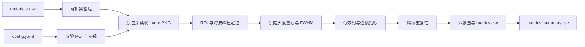

# 线激光预调分析工具改动摘要

## 主要改动

- 新增独立 CLI，实现 metadata 驱动的多实验、多帧离线批处理。
- 新增原位深峰值、亚像素灰度重心、FWHM 和跨帧重复性计算。
- 新增六类统一风格科研图、逐组指标表及全局汇总表。
- 新增严格输入校验、单组错误隔离、示例配置和自动化测试。

## 处理流程

## 图例

- 青色：代表帧中的有效亚像素中心线。
- 淡蓝色：各帧逐列 FWHM。
- 红色：跨帧逐列平均 FWHM。
- 绿色虚线：配置的 FWHM 有效上下限。
- 紫色：逐列中心重复性标准差。

## 数据原则

高斯滤波只用于峰值定位。所有峰值 DN、灰度重心和 FWHM 均由未归一化原始灰度计算；绘图也使用固定显示范围，不进行逐图自动拉伸。
