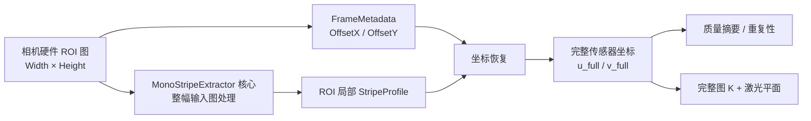

# 相机硬件 ROI 版 450 nm 黑白激光条纹提取算法详解与使用指南

> 新算法：`SensorRoiMonoStripeExtractor`  
> 配置入口：`configs/me2p_1230_450nm_sensor_roi_preset.json`  
> 适用前提：大恒相机已经在采集端设置 `Width/Height/OffsetX/OffsetY`，算法不再进行第二次软件裁剪  
> 坐标策略：算法输出完整传感器坐标，便于继续使用完整图内参和同一激光平面几何模型

## 1. 直接回答：算法中还需要再次做 ROI 吗？

如果相机硬件 ROI 满足以下条件，条纹提取算法中通常不需要再做一次 ROI 裁剪：

1. 硬件 ROI 能覆盖全部预期工作距离、安装位置和样件高度变化下的激光条纹；
2. ROI 内通常只有一条目标激光条纹，没有更强的背景亮线或多重反射；
3. 相机采集适配器能准确记录相机实际采用的 `OffsetX/OffsetY/Width/Height`；
4. Binning、Decimation、ReverseX 和 ReverseY 已关闭，硬件 ROI 只是纯裁剪；
5. 不会在同一批数据中悄悄改变 ROI 而不更新元数据。

在这些条件下，硬件 ROI 优于算法 ROI：

- 硬件 ROI 在相机输出前减少图像行列数，可以降低读出和传输负担；
- 大恒 ME2P-U3 系列官方资料明确说明支持自定义 ROI，降低分辨率可提高帧率；
- 算法 ROI 发生在图像已经传到计算机以后，只能减少部分计算量，不能提高相机实际读出帧率；
- 只保留一个 ROI 来源，可以避免相机 ROI 和算法 ROI 两套坐标、两套配置不同步。

但“取消算法 ROI”不等于“忽略 ROI”。最重要的变化是：相机输出图像的 `(0,0)` 不再代表完整传感器左上角，
而代表硬件 ROI 左上角。必须记录偏移并恢复坐标。

## 2. 硬件 ROI 和软件 ROI 的本质区别

| 项目 | 相机硬件 ROI | 原算法软件 ROI |
|---|---|---|
| 发生位置 | 传感器/相机输出链路 | 图像到达电脑后 |
| 设置方式 | `Width/Height/OffsetX/OffsetY` | `roi_x_start/end`、`roi_y_start/end` |
| 相机输出尺寸 | 已经变小 | 仍接收完整图 |
| 对相机帧率 | 降低输出分辨率可提高可用帧率 | 无法提高传感器读出帧率 |
| USB 传输量 | 减少 | 不减少 |
| 算法计算量 | 输入本身更小 | 通过切片减少后续计算 |
| 输出局部坐标 | 从 `(0,0)` 开始 | 从软件 ROI 左上角开始 |
| 必须记录的偏移 | 相机 `OffsetX/OffsetY` | 算法 ROI 起点 |
| 本项目推荐用途 | 固定高速采集配置 | 初期探索、调试或无法固定硬件 ROI 时 |

大恒相机支持硬件 ROI 并不代表帧率一定按像素数线性提升。最终帧率还可能受曝光时间、传感器读出方式、
USB3 带宽、像素格式、SDK 缓冲和主机性能限制。必须用真实时间戳或实测帧率验证，而不是只按 ROI 高度估算。

## 3. 相机裁剪后，图像 `u,v` 会发生什么变化？

### 3.1 局部 ROI 坐标

假设完整传感器图像尺寸为：

```text
FullWidth  = 4096
FullHeight = 3000
```

相机设置：

```text
Width   = 4096
Height  = 512
OffsetX = 0
OffsetY = 1244
```

相机实际输出数组形状变成：

```text
(512, 4096)
```

输出图像内部坐标仍从零开始：

```text
u_roi = 0 ... 4095
v_roi = 0 ... 511
```

如果激光中心在硬件 ROI 图中为：

```text
u_roi = 2000
v_roi = 255.25
```

它在完整传感器中的坐标是：

```text
u_full = 2000 + 0    = 2000
v_full = 255.25 + 1244 = 1499.25
```

一般公式：

```math
u_{full}=u_{roi}+OffsetX
```

```math
v_{full}=v_{roi}+OffsetY
```

GenICam SFNC 将 `OffsetX/OffsetY` 定义为 ROI 左上角相对于参考图像原点的水平/垂直像素偏移，
设备输出图像的尺寸为 `Width×Height`。

### 3.2 为什么推荐恢复完整传感器坐标？

恢复完整坐标后：

- 相机内参仍可使用完整 4096×3000 图像的主点坐标；
- 同一个物理像素不会因为 ROI 改变而使用不同的坐标值；
- 激光平面标定、射线构造和不同 ROI 数据更容易保持同一坐标契约；
- 后续把中心点叠加回完整图或比较不同 ROI 更直接。

因此新算法固定输出完整传感器坐标，而不是把坐标选择做成另一个容易误配的开关。

## 4. 新算法的设计原则

新算法没有复制上一版约 200 行的条纹提取逻辑，而是复用原 `MonoStripeExtractor`：



### 图例

- **相机硬件 ROI 图**：相机已经完成裁剪，算法不再裁剪。
- **核心提取**：背景估计、峰值、亚像素重心、SNR、FWHM 和饱和逻辑与上一版完全相同。
- **坐标恢复**：只对 `u_px/v_px` 加相机偏移，其他诊断数组不变。
- **完整坐标输出**：与完整图内参、标定图和跨 ROI 比较统一。

代码本质上只有：

```python
local_profile = core_extractor.extract(frame)
u_full = local_profile.u_px + frame.metadata.offset_x_px
v_full = local_profile.v_px + frame.metadata.offset_y_px
```

## 5. 新算法仍然执行哪些条纹处理？

取消的是“第二次软件 ROI 裁剪”，不是取消条纹提取步骤。新算法仍执行：

1. 检查二维数值图像、尺寸、NaN、灰度范围和传感器量程；
2. 对相机输出的每一列计算背景分位数；
3. 计算正残差信号；
4. 使用 1-2-1 纵向滤波寻找每列候选峰；
5. 在未平滑残差上计算局部灰度重心亚像素中心；
6. 计算局部对比度；
7. 使用 MAD 估计噪声并计算稳健 SNR；
8. 使用左右半高交点线性插值计算 FWHM；
9. 判断峰值饱和；
10. 联合对比度、SNR、FWHM、饱和和有限值生成 `valid/confidence`；
11. 把 ROI 局部 `u,v` 加上硬件偏移，得到完整传感器坐标。

背景、重心、SNR、FWHM 和置信度公式与
`reports/450nm_mono_stripe_extraction_guide.md` 中的基础版本完全一致。

## 6. 两版算法的明确区别

| 对比项 | 基础版 `MonoStripeExtractor` | 硬件 ROI 版 `SensorRoiMonoStripeExtractor` |
|---|---|---|
| 配置名称 | `mono` | `mono_sensor_roi` |
| 输入图 | 完整图或任意二维图 | 相机已经裁剪的硬件 ROI 图 |
| 软件 ROI 参数 | 支持 4 个 `roi_*` 参数 | 完全取消，不接受这些参数 |
| 实际处理范围 | 软件 ROI 内 | 相机输出的全部图像 |
| 输出 `u,v` | 相对于输入图；软件 ROI 时加软件偏移 | 自动加硬件 `OffsetX/OffsetY`，输出完整坐标 |
| 强度/质量算法 | 基础实现 | 直接复用基础实现 |
| 质量结果 | 基准 | 与基础版处理同一输入时完全一致 |
| 主要风险 | 软件 ROI 与相机 ROI 双重裁剪/坐标混淆 | Offset 元数据错误、硬件 ROI 把真实条纹裁掉 |
| 适用阶段 | 初期探索、全图调试 | ROI 已经在相机侧冻结的高速实验 |

在同一幅硬件 ROI 图上：

```text
intensity_new  == intensity_old
confidence_new == confidence_old
valid_new      == valid_old
contrast_new   == contrast_old
snr_new        == snr_old
fwhm_new       == fwhm_old
saturated_new  == saturated_old

u_new = u_old + OffsetX
v_new = v_old + OffsetY
```

## 7. 新增的输入元数据

`FrameMetadata` 新增：

| 字段 | 单位 | 含义 |
|---|---:|---|
| `offset_x_px` | pixel | 相机实际 `OffsetX` |
| `offset_y_px` | pixel | 相机实际 `OffsetY` |
| `full_width_px` | pixel | ROI 之前的完整参考图宽度 |
| `full_height_px` | pixel | ROI 之前的完整参考图高度 |

已有的 `width/height` 表示相机本帧实际输出尺寸，不再表示完整传感器尺寸。

例如：

```python
FrameMetadata(
    width=4096,
    height=512,
    offset_x_px=0,
    offset_y_px=1244,
    full_width_px=4096,
    full_height_px=3000,
    # 其他字段省略
)
```

元数据会拒绝以下错误：

```text
OffsetX < 0
OffsetY < 0
OffsetX + Width > FullWidth
OffsetY + Height > FullHeight
```

真实相机适配器必须读取设置完成后相机实际返回的值，而不是只记录请求值。工业相机的 Width、Height 和 Offset
通常有增量或对齐要求，SDK 可能拒绝、钳制或调整请求值。

## 8. 输出字段

新算法仍返回 `StripeProfile`：

| 字段 | 坐标/含义 | 与基础版差异 |
|---|---|---|
| `u_px` | 完整传感器列坐标 | 加 `OffsetX` |
| `v_px` | 完整传感器亚像素行坐标 | 加 `OffsetY` |
| `intensity` | 候选峰原始灰度 | 无差异 |
| `confidence` | 0–1 启发式质量分数 | 无差异 |
| `valid` | 是否通过全部质量门 | 无差异 |
| `contrast` | 局部峰值差 | 无差异 |
| `snr` | 稳健灰度 SNR | 无差异 |
| `fwhm_px` | 半高全宽 | 无差异 |
| `saturated` | 是否达到饱和阈值 | 无差异 |

仍然必须先使用 `valid` 过滤。无效点可能保留有限坐标和诊断值。

## 9. 如何运行硬件 ROI 合成预设

在项目根目录执行：

```powershell
$env:PYTHONPATH="$PWD\src"
python -m line_laser_static --config configs/me2p_1230_450nm_sensor_roi_preset.json
```

该预设模拟：

```text
完整图：4096 × 3000
相机输出：4096 × 512
OffsetX：0
OffsetY：1244
局部条纹中心：约 255.25 px
完整条纹中心：约 1499.25 px
```

配置中的提取部分没有任何 `roi_x_*` 或 `roi_y_*`：

```json
{
  "extraction": {
    "name": "mono_sensor_roi",
    "options": {
      "window_radius": 5,
      "background_percentile": 50.0,
      "min_contrast": 30.0,
      "min_snr": 10.0,
      "noise_floor": 1.0,
      "min_fwhm_px": 3.0,
      "max_fwhm_px": 6.0,
      "saturation_fraction": 0.98,
      "reject_saturated": true,
      "sensor_max_value": 255.0
    }
  }
}
```

当前源仍是合成源。真正的大恒 SDK `FrameSource` 尚未实现。

CLI 仍会进入射线-激光平面求交并写出 CSV/PLY，但当前内参和激光平面是占位值，禁止用于计量。

## 10. 直接调用示例

```python
import time

import numpy as np

from line_laser_static.algorithms import SensorRoiMonoStripeExtractor
from line_laser_static.metrics import summarize_profile_quality
from line_laser_static.models import Frame, FrameMetadata


# 相机已经输出 4096×512 Mono8 硬件 ROI 图
image: np.ndarray = acquire_sensor_roi_image()

frame = Frame(
    image=image,
    metadata=FrameMetadata(
        frame_id=0,
        timestamp_ns=time.time_ns(),
        width=image.shape[1],
        height=image.shape[0],
        exposure_us=2000.0,
        gain_db=0.0,
        pixel_format="Mono8",
        camera_model="ME2P-1230-23U3M",
        serial_number="填写真实序列号",
        sdk_version="填写真实 SDK 版本",
        offset_x_px=0,
        offset_y_px=1244,
        full_width_px=4096,
        full_height_px=3000,
    ),
)

extractor = SensorRoiMonoStripeExtractor(
    window_radius=5,
    background_percentile=50.0,
    min_contrast=30.0,
    min_snr=10.0,
    noise_floor=1.0,
    min_fwhm_px=3.0,
    max_fwhm_px=6.0,
    saturation_fraction=0.98,
    reject_saturated=True,
    sensor_max_value=255.0,
)

profile = extractor.extract(frame)
summary = summarize_profile_quality(profile)

valid_uv_full = np.column_stack(
    [profile.u_px[profile.valid], profile.v_px[profile.valid]]
)

print(summary)
print(valid_uv_full)
```

`valid_uv_full` 已经是完整 4096×3000 坐标，不要再次加 `OffsetX/OffsetY`。

## 11. 相机端 ROI 应该怎样配置？

具体 Galaxy SDK 函数名应以实际安装版本为准，概念上需要设置并读回：

```text
Width
Height
OffsetX
OffsetY
PixelFormat
```

推荐流程：

1. 停止采集；
2. 查询 Width/Height/Offset 的最小值、最大值和增量；
3. 设置目标 ROI；
4. 从相机重新读取实际 Width/Height/OffsetX/OffsetY；
5. 创建缓冲区并开始采集；
6. 把实际值写入每帧或本次采集配置的 `FrameMetadata`；
7. 保存相机 UserSet 或项目配置快照；
8. 用时间戳实测最终帧率和丢帧率。

硬件 ROI 的 `y` 范围建议覆盖：

```text
预期激光中心最小 v
到
预期激光中心最大 v
```

并在上下增加安全余量，覆盖：

- 900–1100 mm 工作距离变化；
- 不同基线和激光器角度；
- 标准台阶高度；
- 相机/支架热漂移；
- 锁紧重复性；
- 激光条纹 FWHM 和散斑边缘。

一旦相机把行裁掉，算法无法恢复丢失的条纹。

## 12. 与 HALCON 相机标定如何匹配？

### 12.1 推荐方案：统一完整传感器坐标

推荐工作流：

1. 使用完整 4096×3000 图像完成 HALCON 相机标定；
2. 保存完整图相机模型；
3. 条纹采集时使用硬件 ROI；
4. 新算法把局部中心加 `OffsetX/OffsetY`；
5. 用恢复后的完整坐标构造相机射线。

纯裁剪不会改变焦距像素值、畸变物理模型或相机/激光器物理关系；只要坐标恢复正确，
改变 ROI 本身不要求重新标定激光平面。

### 12.2 如果 HALCON 使用固定 ROI 图完成标定

如果标定直接在同一个硬件 ROI 图上完成，标定主点通常处于 ROI 局部坐标。为了转换到完整图坐标，
纯裁剪时应满足：

```math
c_{x,full}=c_{x,roi}+OffsetX
```

```math
c_{y,full}=c_{y,roi}+OffsetY
```

`fx/fy` 在纯裁剪且像素尺寸未改变时保持不变。

不能同时使用：

```text
ROI 局部 u,v + 完整图主点
```

也不能同时使用：

```text
完整图 u,v + ROI 局部主点
```

HALCON 相机模型转换到本项目射线模型时，还需要核对其模型类型、像素中心约定、畸变参数和单位；
不能只复制参数数组而不做留出点验证。

## 13. 必须特别注意的情况

### 13.1 Binning 和 Decimation

本版本只处理“纯 ROI 裁剪”。如果启用了 Binning 或 Decimation：

- 输出像素不再与完整传感器像素一一对应；
- `u_full=u_roi+OffsetX` 可能不再成立；
- 焦距和主点需要按缩放关系调整或重新标定；
- FWHM 像素值也不能直接与 1×1 模式比较。

因此安装位置比较期间建议固定为 1×1，并在元数据中记录实际设置。

### 13.2 ReverseX / ReverseY

若启用水平或垂直镜像，坐标不是简单加偏移。当前算法不处理镜像，建议关闭。

### 13.3 动态修改硬件 ROI

如果运行过程中改变 `OffsetY`，每帧必须关联正确的偏移元数据。最安全的做法是每个机械工况固定一个 ROI，
停止采集后修改，并生成新的配置版本。

### 13.4 强反光和多条亮线

取消软件 ROI 后，算法会处理相机输出的全部区域。若硬件 ROI 仍包含强亮边、多重反射或两条候选线，
当前逐列单峰算法可能误选。应优先改善硬件 ROI 和光学条件；仍不满足时再引入多候选路径跟踪。

### 13.5 不同安装位置的公平比较

如果每个安装位置需要不同 `OffsetY` 才能覆盖条纹，这是允许的，但必须：

- 将所有结果恢复到完整坐标；
- 记录每个位置的实际 Offset；
- 保持曝光、增益、像素格式、条纹算法阈值不变；
- 保证 ROI 高度和上下安全余量采用同一规则；
- 不把 ROI 裁剪造成的断线误认为算法失败或安装位置性能差。

## 14. 何时仍建议保留软件 ROI 版本？

以下阶段仍可使用基础 `MonoStripeExtractor`：

- 初次装调，还不知道条纹会出现在哪里；
- 需要在完整图中观察遮挡、多反射和背景亮边；
- 相机 ROI 暂时不能稳定配置；
- 需要在同一幅全图上离线比较多个候选 ROI；
- 调试算法失败样例，希望保留完整上下文。

当条纹位置范围已经通过实验确定，并且硬件 ROI 有足够安全余量后，再切换到硬件 ROI 版用于高速固定采集。

## 15. 测试与验证

运行硬件 ROI 专项测试：

```powershell
$env:PYTHONPATH="$PWD\src"
python -m unittest discover -s tests -p "test_sensor_roi_extraction.py" -v
```

测试覆盖：

- 新版构造器不包含软件 ROI 参数；
- 局部坐标正确恢复为完整坐标；
- 新旧版本只在坐标原点上不同；
- ROI 越过完整图边界时拒绝元数据；
- 4096×512 合成硬件 ROI 预设恢复到约 `v_full=1499.25`。

运行全部测试：

```powershell
$env:PYTHONPATH="$PWD\src"
python -m unittest discover -s tests -v
```

## 16. 相关文件

| 文件 | 作用 |
|---|---|
| `src/line_laser_static/algorithms/sensor_roi.py` | 无软件 ROI 的坐标适配层 |
| `src/line_laser_static/algorithms/mono.py` | 两版本共用的条纹提取核心 |
| `src/line_laser_static/models.py` | 硬件 ROI 偏移和完整尺寸元数据 |
| `src/line_laser_static/sources/synthetic.py` | 可模拟硬件 ROI 的合成源 |
| `configs/me2p_1230_450nm_sensor_roi_preset.json` | 4096×512 硬件 ROI 合成预设 |
| `tests/test_sensor_roi_extraction.py` | 坐标、兼容性和预设测试 |
| `reports/450nm_mono_stripe_extraction_guide.md` | 基础软件 ROI 版本详解 |

## 17. 真实相机接入检查清单

- [ ] 相机 ROI 的实际 Width/Height/OffsetX/OffsetY 已从设备读回；
- [ ] `Frame.image.shape == (Height, Width)`；
- [ ] `FrameMetadata.width/height` 表示输出 ROI 尺寸；
- [ ] `full_width_px/full_height_px` 表示完整参考图尺寸；
- [ ] Binning、Decimation、ReverseX、ReverseY 已关闭；
- [ ] ROI 上下边界覆盖所有工况并保留安全余量；
- [ ] 运行期间 ROI 固定，或每帧偏移能够准确追溯；
- [ ] 输出中心没有被再次加 Offset；
- [ ] 完整坐标与 HALCON 内参处于同一坐标系；
- [ ] 用已知像素点验证局部到完整坐标转换；
- [ ] 实测最终帧率、CPU 占用和丢帧率；
- [ ] 保存相机 UserSet、项目配置和机械配置编号。

## 18. 参考资料

- [大恒图像：水星二代 PRO USB3.0 相机资料，支持自定义 ROI，降低分辨率可提高帧率](https://www.daheng-imaging.com/uploadfile/2022/1103/20221103021652138.pdf)
- [EMVA GenICam SFNC 2.3：Width、Height、OffsetX、OffsetY 与 ROI 坐标定义](https://www.emva.org/wp-content/uploads/GenICam_SFNC_2_3.pdf)

具体 ME2P-1230 在当前固件和 Galaxy SDK 下允许的 Width/Height/Offset 增量，应在设备连接后通过节点属性读取并实测确认。
