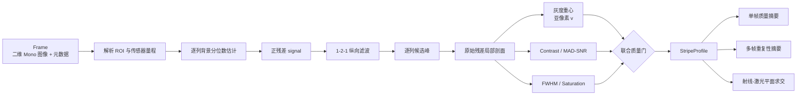

# 450 nm 黑白相机激光条纹提取算法详解与使用指南

> 适用代码版本：`codex/mono450-stripe-extraction`，提交 `d1f8bc5`  
> 主要实现：`src/line_laser_static/algorithms/mono.py`  
> 适用硬件起点：大恒 ME2P-1230-23U3M、4096 × 3000、Mono8/Mono12、450 nm 线激光  
> 文档目的：说明算法为什么这样设计、每一步做什么、如何调用、需要输入什么以及会输出什么。

## 1. 先给出结论

当前 `MonoStripeExtractor` 是一个面向“近似横向线激光条纹”的逐列亚像素中心提取器。
它不再依赖旧方案中的红色通道差分，而是直接处理黑白相机输出的二维灰度图。

算法的核心思想是：

1. 对每一列估计背景并抑制背景；
2. 通过轻量纵向滤波找到该列最可能的激光峰；
3. 在峰值附近用灰度重心计算亚像素中心；
4. 同时计算对比度、SNR、FWHM 和饱和状态；
5. 只有全部质量条件通过时，才把该列标记为有效。

当前实现适合先完成以下工作：

- 比较不同相机/激光器安装位置下的二维条纹质量；
- 比较条纹宽度、信噪比、有效率和多帧中心重复性；
- 为后续激光平面标定提供稳定的二维中心点；
- 在合成图和后续真实 Mono8/Mono12 图像之间保持同一数据接口。

当前实现还不能直接替代完整的真实设备程序，原因是大恒相机 SDK、真实暗场帧扣除、
HALCON 非零畸变转换、批量真实图像入口和逐列诊断 CSV 尚未接入。本文后面会明确说明这些边界。

## 2. 坐标、图像方向与基本数据约定

### 2.1 图像坐标

输入图像数组形状为：

```text
(height, width)
```

坐标定义为：

- `u`：图像列坐标，向右增加；
- `v`：图像行坐标，向下增加；
- 数组访问：`image[v, u]`；
- 条纹近似横向，因此算法沿 `u` 方向逐列扫描，在每一列求一个 `v` 中心。

如果设置 ROI，ROI 使用左闭右开区间：

```text
x: [roi_x_start, roi_x_end)
y: [roi_y_start, roi_y_end)
```

输出的 `u_px` 和 `v_px` 会恢复为整幅图像坐标，不是 ROI 内局部坐标。

### 2.2 输入图像约束

`Frame.image` 必须满足：

- 是二维数组；
- 是数值类型；
- 尺寸与 `FrameMetadata.width/height` 一致；
- 不包含 `NaN` 或无穷值；
- 灰度不小于 0；
- 灰度不超过当前传感器量程。

彩色 BGR/RGB 图像不能直接输入。如果相机 SDK 返回三维数组，必须先确认设备是否真的工作在
Mono 模式，并转换成二维单通道数组。

## 3. 整体代码流程图



### 图例

- **候选峰链路**：使用轻量滤波结果定位峰值，主要目的是降低单像素噪声误选。
- **亚像素链路**：使用未做平滑的背景抑制信号计算重心，避免平滑额外改变中心位置。
- **质量链路**：对比度、SNR、FWHM、饱和与数值有效性共同决定 `valid`。
- **后续几何链路**：只有完成真实相机标定和该安装位的激光平面标定后，三维结果才有计量意义。

## 4. 算法步骤与原理

下面用 `I(v,u)` 表示输入灰度，`u` 是列，`v` 是行。

### 步骤 1：解析 ROI

算法先把未设置的 ROI 边界替换成整幅图范围，并检查：

```text
0 <= start < end <= image_size
```

使用 ROI 有三个目的：

1. 排除已知不可能出现激光条纹的区域；
2. 降低背景亮边、文字和反光物被误选为峰值的概率；
3. 降低全分辨率图像的计算量。

在安装位置尚未确定时，可以先使用全图；当条纹大致位置稳定后，建议优先收紧 `y` 方向 ROI，
但必须保留足够余量，避免工作距离变化或台阶引起的真实条纹位移被裁掉。

### 步骤 2：确定灰度量程

灰度上限 `sensor_max` 按以下优先级确定：

1. 如果配置了 `sensor_max_value`，直接使用该值；
2. 否则从 `FrameMetadata.pixel_format` 中解析 `MonoN`，使用 `2^N-1`；
3. 如果无法解析但图像是整数类型，使用该整数类型的最大值；
4. 浮点图像无法自动判断量程，必须显式设置 `sensor_max_value`。

典型例子：

| 像素格式 | 常见 NumPy 类型 | 有效灰度范围 | 推荐设置 |
|---|---|---:|---|
| Mono8 | `uint8` | 0–255 | `sensor_max_value=255` 或自动解析 |
| Mono12，解包到 16 bit | `uint16` | 0–4095 | `pixel_format="Mono12"`，不要按 65535 处理 |
| Mono16 | `uint16` | 0–65535 | `pixel_format="Mono16"` 或显式设置 65535 |

如果 SDK 返回的是 Mono12 Packed，必须先用 SDK 或专用解包逻辑转换成二维 `uint16`，
再交给本算法。算法本身不负责解析相机厂商的打包字节流。

### 步骤 3：逐列背景估计与正残差

在 ROI 中，对每一列计算指定分位数：

```math
B(u) = P_p\{I(v,u)\}
```

其中 `p` 是 `background_percentile`。随后计算：

```math
S(v,u) = \max(I(v,u)-B(u), 0)
```

预设值使用第 50 百分位，也就是每列中位数。这样做的原因是：正常线激光通常只占一列中的少量像素，
中位数主要反映非激光背景，且比均值更不容易被亮条纹和少量异常点拉高。

这个步骤是“逐列背景估计”，不是严格意义上的暗场帧扣除。它能抑制列间亮度偏置和均匀背景，
但不能完全消除纹理背景、宽亮区域、多重反射或固定图案噪声。真实暗场/背景帧扣除仍是后续待接入功能。

### 步骤 4：1-2-1 纵向轻量滤波

对正残差信号的内部行使用：

```math
S_f(v,u)=\frac{S(v-1,u)+2S(v,u)+S(v+1,u)}{4}
```

第一行和最后一行保持原值。

这个核等价于很轻的纵向平滑，用来降低孤立噪声点抢占峰值的概率。重要的是：

- 滤波结果只用于寻找候选峰；
- 后续亚像素重心仍使用未平滑的 `S(v,u)`；
- 因此滤波对最终中心位置的直接影响较小。

### 步骤 5：逐列寻找候选峰

对每一列寻找滤波信号的最大值行：

```math
v_{peak}(u)=\arg\max_v S_f(v,u)
```

这一步假定每列的目标激光峰通常比背景残差更强。当前实现每列只保留一个候选峰，
没有实现多候选动态规划。当画面中存在两条相近亮线、强反光边或多路径激光时，必须依靠 ROI、
光学抑制和后续质量门降低误选，复杂场景可能需要升级为多候选连续跟踪。

### 步骤 6：提取峰值附近的局部剖面

剖面半径为：

```text
profile_radius = max(window_radius, ceil(max_fwhm_px) + 1)
```

这样既能覆盖亚像素重心窗口，也给 FWHM 左右半高交点留出搜索空间。

剖面取自未平滑的正残差 `S`。每列剖面再次减去自己的最小值，使局部基线回到零附近：

```math
P(k,u)=S(v_{peak}+k,u)-\min_k S(v_{peak}+k,u)
```

越过图像边界的采样权重被置零。

### 步骤 7：灰度重心亚像素中心

只在 `|k| <= window_radius` 的范围内计算重心。设局部行坐标为 `v_i`、权重为 `w_i`：

```math
v_c(u)=\frac{\sum_i v_iw_i}{\sum_i w_i}
```

当权重和为零时，该列中心为 `NaN`，并标记为无效。

灰度重心的优点：

- 公式简单，只有 NumPy 依赖；
- 对近似高斯、单峰、不过曝条纹可以得到稳定亚像素中心；
- 计算量小，适合作为新硬件的第一版基线。

它的限制：

- 对不对称散斑、拖尾和邻近反光敏感；
- 窗口过小会截断条纹，过大则容易混入背景；
- 饱和峰的顶部被削平，重心可能产生系统偏差；
- 当前没有高斯拟合、Steger/Hessian 或多候选路径优化。

### 步骤 8：对比度

当前实现把局部零基线剖面的峰值定义为对比度：

```math
C(u)=\max_k P(k,u)
```

它不是全图最大灰度，也不是激光开/关帧之差，而是当前列局部剖面相对局部基线的峰值。

### 步骤 9：MAD 噪声与 SNR

对 ROI 中每一列的原始灰度计算中位数：

```math
m(u)=\operatorname{median}_v I(v,u)
```

再计算中位绝对偏差：

```math
MAD(u)=\operatorname{median}_v |I(v,u)-m(u)|
```

把 MAD 换算成近似高斯噪声标准差：

```math
\sigma_n(u)=\max(1.4826\times MAD(u), noise\_floor)
```

最终：

```math
SNR(u)=\frac{C(u)}{\sigma_n(u)}
```

`noise_floor` 防止完全平坦或量化后的合成图出现除零和虚高 SNR。

这里的 SNR 是用于算法筛选的稳健灰度比值，不是相机数据手册中的 dB 信噪比。
如果 ROI 中包含大范围真实亮度变化，MAD 会把纹理或渐变也当成噪声，因此应合理限制 ROI。

### 步骤 10：FWHM

FWHM 是 Full Width at Half Maximum，即半高全宽。

对每列局部剖面：

1. 找到剖面峰值 `Pmax`；
2. 计算半高 `Pmax/2`；
3. 从峰值向左寻找第一次跌到半高以下的位置；
4. 从峰值向右做同样操作；
5. 两侧都用相邻像素做线性插值；
6. 右半高交点减左半高交点得到亚像素宽度。

如果局部剖面在搜索范围内没有完整跌到半高以下，FWHM 返回 `NaN`，该列不能通过宽度质量门。

FWHM 用于评价条纹成像宽度。项目当前调参目标为中央 80% 区域 3–6 px。
需要特别注意：FWHM 不是最终三维分辨率，它只描述图像中的激光条纹宽度。

### 步骤 11：饱和判断

当前列候选峰的原始灰度为 `peak_intensity`。当：

```math
peak\_intensity \ge sensor\_max\times saturation\_fraction
```

该列 `saturated=True`。

预设 `saturation_fraction=0.98`。Mono8 时阈值约为 249.9；Mono12 时约为 4013.1。
如果 `reject_saturated=true`，饱和列直接无效，置信度置零。

### 步骤 12：联合有效性判断

一列必须同时满足以下条件：

```text
重心权重和 > 0
v_px 是有限数
contrast >= min_contrast
snr >= min_snr
min_fwhm_px <= fwhm_px <= max_fwhm_px
如果 reject_saturated=true，则 saturated 必须为 false
```

最终布尔结果写入 `valid`。

不要仅凭 `confidence` 判断有效性；下游逻辑应先检查 `valid`。

### 步骤 13：置信度

对比度分数：

```math
q_C=clip\left(\frac{C}{2C_{min}},0,1\right)
```

SNR 分数：

```math
q_S=clip\left(\frac{SNR}{2SNR_{min}},0,1\right)
```

设允许 FWHM 范围的中点和半宽分别为 `Wmid`、`Whalf`：

```math
q_W=clip\left(1-0.5\frac{|W-W_{mid}|}{W_{half}},0,1\right)
```

最终：

```math
confidence=min(q_C,q_S,q_W)
```

饱和拒绝开启时，饱和列置信度强制为 0。

这个置信度是启发式质量分数，不是经过统计标定的正确概率。即使某列 `confidence>0`，
也可能因为 FWHM 超出硬范围而 `valid=false`。

## 5. 输入：具体应该提供什么

算法入口是：

```python
profile = extractor.extract(frame)
```

其中 `frame` 是 `Frame` 数据类，包含图像和元数据。

### 5.1 `Frame.image`

推荐类型：

- Mono8：`numpy.ndarray`，形状 `(H,W)`，`dtype=np.uint8`；
- Mono12：解包后的 `numpy.ndarray`，形状 `(H,W)`，`dtype=np.uint16`，有效值 0–4095；
- 浮点预处理图：允许，但必须显式设置 `sensor_max_value`。

不应输入：

- BGR/RGB 三通道图；
- 厂商 Mono12 Packed 原始字节流；
- 已经错误归一化、溢出或带负数的图；
- 图像尺寸与元数据不一致的数组。

### 5.2 `FrameMetadata`

| 字段 | 含义 | 条纹提取是否直接使用 |
|---|---|---|
| `frame_id` | 帧编号 | 否，用于追溯 |
| `timestamp_ns` | 时间戳 | 否，用于追溯/同步 |
| `width`,`height` | 图像尺寸 | 是，用于尺寸与 ROI 校验 |
| `exposure_us` | 曝光时间 | 否，但应真实记录 |
| `gain_db` | 模拟/数字增益 | 否，但应真实记录 |
| `pixel_format` | 如 `Mono8`、`Mono12` | 是，用于自动推导量程 |
| `camera_model` | 相机型号 | 否，用于追溯 |
| `serial_number` | 序列号 | 否，用于追溯 |
| `sdk_version` | SDK 版本 | 否，用于复现 |

真实实验必须填写真实元数据。否则不同安装位置之间即使结果不同，也无法排除曝光、增益或 SDK 设置变化。

## 6. 输出：算法会返回什么

`extract()` 返回 `StripeProfile`。所有字段都是长度相同的一维数组，长度通常为 ROI 的列数：

```text
N = roi_x_end - roi_x_start
```

| 字段 | 类型 | 单位/范围 | 含义 |
|---|---|---|---|
| `u_px` | 浮点数组 | pixel | 整幅图中的列坐标 |
| `v_px` | 浮点数组 | pixel | 亚像素行坐标，已加回 ROI 偏移 |
| `intensity` | 浮点数组 | DN | 候选峰位置的原始灰度 |
| `confidence` | 浮点数组 | 0–1 | 启发式联合质量分数 |
| `valid` | 布尔数组 | true/false | 是否通过全部质量门 |
| `contrast` | 浮点数组 | DN | 局部剖面相对基线的峰值 |
| `snr` | 浮点数组 | 无量纲 | `contrast / robust_noise_sigma` |
| `fwhm_px` | 浮点数组 | pixel | 半高全宽，可能为 `NaN` |
| `saturated` | 布尔数组 | true/false | 候选峰是否达到饱和阈值 |

注意：无效列可能仍保留有限的 `v_px`、`contrast`、`snr` 和 `fwhm_px`，用于诊断。
任何计量或几何计算都必须使用 `valid` 过滤。

## 7. 单帧质量摘要与多帧重复性输出

### 7.1 单帧摘要

`summarize_profile_quality(profile)` 输出字典，包含：

| 字段 | 含义 |
|---|---|
| `point_count` | ROI 总列数 |
| `valid_count` | 有效列数 |
| `valid_ratio` | 有效列比例 |
| `contrast_median/p05/p95` | 对比度分布 |
| `snr_median/p05/p95` | SNR 分布 |
| `fwhm_px_median/p05/p95` | FWHM 分布 |
| `saturated_count/ratio` | 饱和列数量和比例 |
| `center_step_abs_px_p95` | 相邻有效列中心差绝对值的 P95 |

当前对比度、SNR 和 FWHM 的分位数使用所有有限值，不仅使用 `valid=true` 的列；
因此应与 `valid_ratio`、饱和率一起解释，不能只看一个中位数。

`center_step_abs_px_p95` 只使用 `u` 相邻且两列都有效的点。它可以发现跳线，但也会包含真实台阶造成的中心突变，
所以不能单独作为平滑程度的硬门槛。

### 7.2 多帧重复性

`summarize_repeatability(profiles)` 至少需要两个 `StripeProfile`，并要求所有帧的 `u_px` 完全一致。

输出：

| 字段 | 含义 |
|---|---|
| `frame_count` | 输入帧数 |
| `column_count` | 总列数 |
| `repeatable_column_count` | 至少有两帧有效中心的列数 |
| `repeatable_column_ratio` | 可统计重复性的列比例 |
| `mean_frame_valid_ratio` | 各帧有效率的均值 |
| `center_std_px_median` | 各列中心样本标准差的中位数 |
| `center_std_px_p95` | 各列中心样本标准差的 P95 |
| `center_std_px_max` | 各列中心样本标准差最大值 |

每列使用 `ddof=1` 的样本标准差，仅使用该列 `valid=true` 且中心有限的帧。

## 8. 配置参数详解

| 参数 | 类默认值 | 450 nm 预设 | 作用与调节方向 |
|---|---:|---:|---|
| `window_radius` | 5 | 5 | 重心半窗口；过小会截断，过大易混入背景 |
| `background_percentile` | 50 | 50 | 每列背景分位数；当前相当于列中位数 |
| `min_contrast` | 30 | 30 | 最低局部峰值差；越大越严格 |
| `min_snr` | 10 | 10 | 最低稳健 SNR；越大越严格 |
| `noise_floor` | 1 | 1 | 噪声标准差下限，防止 SNR 虚高/除零 |
| `min_fwhm_px` | 2 | 3 | 最小允许条纹宽度 |
| `max_fwhm_px` | 10 | 6 | 最大允许条纹宽度 |
| `saturation_fraction` | 0.98 | 0.98 | 相对传感器满量程的饱和判定阈值 |
| `reject_saturated` | true | true | 是否直接拒绝饱和列 |
| `sensor_max_value` | 自动 | 255 | 量程上限；Mono12 应为 4095 |
| `roi_x_start/end` | 全宽 | 全宽 | 列方向 ROI，左闭右开 |
| `roi_y_start/end` | 全高 | 全高 | 行方向 ROI，左闭右开 |

预设中的 FWHM 3–6 px 来自当前研发验收目标，不代表所有表面和曝光下都应机械套用。
参数必须在固定的 tuning 数据上确定，然后冻结用于不同安装位置比较。

## 9. 如何运行

### 9.1 环境要求

核心工程要求：

```text
Python >= 3.10
NumPy >= 1.26
```

在项目根目录 PowerShell 中设置源码路径：

```powershell
$env:PYTHONPATH="$PWD\src"
```

### 9.2 运行 450 nm 全分辨率合成预设

```powershell
$env:PYTHONPATH="$PWD\src"
python -m line_laser_static --config configs/me2p_1230_450nm_preset.json
```

该配置当前使用的是 4096 × 3000 合成 Mono8 图，不是大恒相机实时采集。

运行目录：

```text
outputs/me2p-1230-450nm-preset/<UTC运行编号>/
```

包含：

```text
profile.csv
profile.ply
run_summary.json
```

重要说明：`profile.csv` 和 `profile.ply` 当前导出的是三维 `PointCloud` 字段：

```text
x_mm,y_mm,z_mm,intensity,confidence,valid
```

它们不包含逐列 `contrast/snr/fwhm_px/saturated`。这些详细数组目前只保存在内存中的
`StripeProfile`；`run_summary.json` 保存它们的聚合统计。

更重要的是，当前预设内参和激光平面是占位值，所以 CLI 生成的三维 CSV/PLY 只能验证程序链路，
不能用于测量或评价真实精度。

### 9.3 运行测试

运行全部测试：

```powershell
$env:PYTHONPATH="$PWD\src"
python -m unittest discover -s tests -v
```

只运行黑白条纹提取测试：

```powershell
$env:PYTHONPATH="$PWD\src"
python -m unittest discover -s tests -p "test_mono_extraction.py" -v
```

测试覆盖：

- Mono8 亚像素中心和 FWHM；
- 弱条纹拒绝；
- 饱和条纹拒绝；
- Mono12 量程解析；
- 单帧质量摘要；
- 多帧重复性；
- 相机预设明确标记为不可计量。

### 9.4 直接输入一幅 NumPy 黑白图

当你已经通过相机 SDK、图像文件或其他方式得到二维 NumPy 数组时，可以直接构造 `Frame`：

```python
import time

import numpy as np

from line_laser_static.algorithms import MonoStripeExtractor
from line_laser_static.metrics import summarize_profile_quality
from line_laser_static.models import Frame, FrameMetadata


# Mono8: shape=(3000, 4096), dtype=uint8
# Mono12: shape=(3000, 4096), dtype=uint16, effective values 0..4095
image: np.ndarray = acquire_or_load_image()

frame = Frame(
    image=image,
    metadata=FrameMetadata(
        frame_id=0,
        timestamp_ns=time.time_ns(),
        width=image.shape[1],
        height=image.shape[0],
        exposure_us=2000.0,
        gain_db=0.0,
        pixel_format="Mono8",  # Mono12 数据必须写成 Mono12
        camera_model="ME2P-1230-23U3M",
        serial_number="填写真实序列号",
        sdk_version="填写真实 SDK 版本",
    ),
)

extractor = MonoStripeExtractor(
    window_radius=5,
    background_percentile=50.0,
    min_contrast=30.0,
    min_snr=10.0,
    noise_floor=1.0,
    min_fwhm_px=3.0,
    max_fwhm_px=6.0,
    saturation_fraction=0.98,
    reject_saturated=True,
    sensor_max_value=255.0,
    roi_x_start=None,
    roi_x_end=None,
    roi_y_start=None,
    roi_y_end=None,
)

profile = extractor.extract(frame)
summary = summarize_profile_quality(profile)

valid_uv = np.column_stack(
    [profile.u_px[profile.valid], profile.v_px[profile.valid]]
)

print(summary)
print(valid_uv.shape)
```

对于 Mono12，至少要同步修改：

```python
pixel_format="Mono12"
sensor_max_value=4095.0  # 也可以设为 None，让 Mono12 自动解析
```

`min_contrast`、`noise_floor` 等灰度阈值不能机械沿用 Mono8 数值，必须用 Mono12 实际数据重新确定。

### 9.5 多帧重复性示例

```python
from line_laser_static.metrics import summarize_repeatability

profiles = []
for frame_id in range(100):
    frame = capture_frame(frame_id)
    profiles.append(extractor.extract(frame))

repeatability = summarize_repeatability(profiles)
print(repeatability)
```

所有帧必须使用相同分辨率和相同 ROI，否则 `u_px` 不一致，函数会拒绝统计。

## 10. `run_summary.json` 如何理解

运行摘要的主要结构为：

```json
{
  "context": {
    "config_version": "...",
    "calibration_version": "...",
    "mechanical_config_id": "...",
    "dataset_id": "..."
  },
  "frame": {
    "width": 4096,
    "height": 3000,
    "exposure_us": 2000.0,
    "gain_db": 0.0,
    "pixel_format": "Mono8"
  },
  "profile": {
    "point_count": 4096,
    "valid_count": 4096,
    "valid_ratio": 1.0,
    "contrast_median": 197.0,
    "snr_median": 132.87,
    "fwhm_px_median": 4.074,
    "saturated_ratio": 0.0
  },
  "point_cloud": {
    "unit": "mm"
  }
}
```

上面的数值来自全分辨率合成烟雾测试，只证明算法和配置链路能够运行，不能代表真实相机性能。

比较不同安装位置时，至少同时观察：

1. `valid_ratio`；
2. `fwhm_px_median/p95`；
3. `snr_median/p05`；
4. `saturated_ratio`；
5. 多帧 `center_std_px_median/p95`；
6. 原始图中的覆盖长度、遮挡和多反射位置。

不要只按 SNR 最高选安装位置。更大的激光亮度可能同时带来更宽条纹、饱和、散斑或遮挡。

## 11. 推荐调参顺序

### 第 1 步：固定不可同时变化的条件

先固定：

- 分辨率和像素格式；
- 镜头焦点、光圈和滤光片；
- 激光器功率；
- 曝光时间和增益；
- 相机内部锐化、降噪、Gamma、平场校正设置；
- 工作距离和测试表面。

如果这些条件与算法阈值同时变化，无法判断性能变化来自哪里。

### 第 2 步：检查输入量程和饱和

先确认原始图最大值、像素格式和 `sensor_max_value` 一致。优先通过曝光、光圈或激光功率控制饱和，
不要单纯把 `saturation_fraction` 调高来掩盖过曝。

### 第 3 步：设置 ROI

先使用足够宽的 ROI 观察条纹位置范围，再缩小 `y` ROI 排除无关亮边。
`x` ROI 可以用于只评价中央 80% 或有效覆盖区域，但安装位比较时各工况必须使用同一规则。

### 第 4 步：观察 FWHM 并设置重心窗口

先统计真实条纹 FWHM。若目标为 3–6 px，`window_radius=5` 通常能覆盖主要能量。
如果 FWHM 明显大于窗口，应先改善焦点、光圈、激光成像和表面条件，再考虑加大窗口。

### 第 5 步：设置对比度和 SNR 门槛

在 tuning 数据中同时采集正常条纹、弱条纹和无激光背景。选择能保留真实条纹并拒绝背景峰的阈值。
当前研发目标 `min_snr=10` 可以作为起点，但必须用真实图验证。

### 第 6 步：冻结参数再比较安装位置

同一轮安装位置实验必须使用同一组算法参数。不能针对每个位置分别调阈值后再比较，
否则比较的是“位置 + 参数”的组合，不是安装位置本身。

## 12. 常见问题与排查

| 现象 | 可能原因 | 优先处理 |
|---|---|---|
| 全部 `valid=false` | 量程写错、对比度/SNR门槛过高、FWHM范围不合适 | 检查 `pixel_format`、灰度最大值和各诊断数组 |
| Mono12 SNR/饱和异常 | 把有效 0–4095 当成 uint16 的 0–65535 | 使用 `Mono12` 或显式 `sensor_max_value=4095` |
| 选到背景亮边 | ROI 太宽、背景纹理比激光强、存在多反射 | 先收紧 ROI/改善光学，再考虑多候选跟踪 |
| 中心抖动大 | 曝光不足、增益过高、散斑、条纹太窄或窗口不合适 | 固定平面采 100 帧，分别检查 SNR/FWHM/饱和 |
| FWHM 为 `NaN` | 半高交点未在局部剖面内闭合 | 检查峰是否贴边、条纹是否过宽、ROI 是否裁剪 |
| `confidence>0` 但无效 | 置信度是软分数，某个硬门槛未通过 | 始终先使用 `valid`，再看 confidence |
| `v_px` 有数但无效 | 算法保留诊断中心 | 计量前必须用 `valid` 过滤 |
| 跳线或双线误选 | 当前每列只保留一个最强峰 | 改善 ROI/光学；必要时升级动态规划或 Steger |
| CLI 能运行但三维数值不可信 | 使用了占位内参和占位激光平面 | 完成 HALCON 内参与当前安装位激光平面标定 |
| 不同位置结果不可比较 | 曝光、增益、ROI或阈值同时变化 | 每轮只改变机械主变量并冻结采集/算法配置 |

## 13. 相机内参与条纹提取的关系

当前 `MonoStripeExtractor` 本身不读取相机矩阵或畸变参数。它在原始图像坐标中提取二维中心。

预设文件中的名义内参：

```text
fx = fy = 25 mm / 0.00345 mm = 7246.3768 px
cx = 2047.5
cy = 1499.5
distortion = 0（占位）
```

这些值只用于让合成三维链路可运行，不能替代 HALCON 标定。

完成 HALCON 标定后需要注意：

1. HALCON 相机模型参数不能不经转换直接当成当前工程的 OpenCV 风格 `K/D`；
2. 当前 `RayPlaneReconstructor` 只接受已去畸变像素；
3. 可以对提取后的亚像素点做畸变校正，避免全图重采样改变灰度中心；
4. 改变焦点、分辨率、Binning、Decimation 或传感器 ROI 后，应重新确认内参；
5. 改变相机与激光器相对位置后，相机内参通常仍可使用，但激光平面必须重新标定。

## 14. 当前实现与后续升级边界

### 已实现

- 二维单通道输入校验；
- Mono8/Mono12 量程处理；
- ROI；
- 逐列背景分位数抑制；
- 轻量峰值滤波；
- 灰度重心亚像素中心；
- 对比度、MAD-SNR、FWHM、饱和；
- 有效性和置信度；
- 单帧质量摘要；
- 多帧中心重复性摘要；
- 合成源 CLI 和自动化测试。

### 尚未实现

- 大恒 Galaxy SDK `FrameSource`；
- 真实激光关闭帧/背景帧扣除；
- 从 BMP/TIFF/PNG/RAW 目录批量读取真实图像；
- 每列多候选峰与动态规划连续路径；
- Steger/Hessian 亚像素中心；
- HALCON 非零畸变到当前射线模型的转换；
- 逐列质量字段的 CSV/NPZ 导出；
- 针对不同安装位置的批量实验汇总和自动排名；
- 真实激光平面标定与最终计量验收。

建议只有在真实数据证明当前重心基线达不到重复性或抗干扰要求时，才引入 Steger、
高斯拟合或动态规划，避免在没有失败样例前增加不必要复杂度。

## 15. 相关文件

| 文件 | 作用 |
|---|---|
| `src/line_laser_static/algorithms/mono.py` | 黑白条纹提取核心算法 |
| `src/line_laser_static/metrics.py` | 单帧质量和多帧重复性 |
| `src/line_laser_static/models.py` | `Frame`、`StripeProfile` 数据契约 |
| `src/line_laser_static/bootstrap.py` | 根据配置选择 `mono` 提取器 |
| `src/line_laser_static/pipeline.py` | 采集、提取、重建和运行摘要 |
| `configs/me2p_1230_450nm_preset.json` | 4096 × 3000 Mono8 合成调参预设 |
| `calibration/me2p_1230_450nm_preset.json` | 名义内参与占位激光平面 |
| `tests/test_mono_extraction.py` | Mono8/Mono12、质量门和指标测试 |

## 16. 真实图像投入前检查清单

- [ ] 相机输出确认为 Mono8 或已解包 Mono12；
- [ ] 图像数组为 `(height,width)` 二维结构；
- [ ] `pixel_format` 与实际数据有效位数一致；
- [ ] 元数据宽高与数组一致；
- [ ] 曝光、增益、相机内部处理参数已记录；
- [ ] 图像无负值、NaN、无穷和错误溢出；
- [ ] ROI 覆盖全部可能的真实条纹位置；
- [ ] 正常、弱光、无激光、饱和样例均进入 tuning 数据；
- [ ] 算法参数在安装位比较前已经冻结；
- [ ] 下游始终使用 `valid` 过滤；
- [ ] 三维输出前已替换真实内参并处理畸变；
- [ ] 每个机械安装位使用自己的激光平面标定版本。

## 17. 最小验收建议

在真实 ME2P 图像接入后，建议先完成以下最小闭环：

1. 同一固定平面连续采集 100 帧；
2. 有效中心点比例不低于 95%；
3. 中央 80% FWHM 主要位于 3–6 px；
4. SNR 不低于 10；
5. 饱和列比例小于 1%；
6. 中心标准差中位数和 P95 稳定，无局部系统性跳线；
7. 固定输入重复运行得到完全一致的输出；
8. 人工检查原始图、中心叠加图和失败列位置，确认没有多线误选。

通过这一步后，再把同一套冻结算法用于不同相机/激光器安装位置的公平比较。
