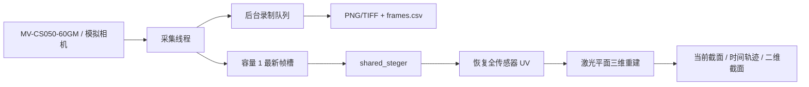

# 在线一键点云系统 v1 实施交接

日期：2026-07-31  
工作树：`G:\dev\projects\0704linescan-online-v1`  
分支：`codex/online-pointcloud-v1`  
状态：代码与模拟链路完成，海康实机验收等待官方 Python SDK 绑定和相机。

## 已完成

- WPS 离线工具完整复制到隔离工作树，排除了 `output`、缓存和 `.pyc`。
- SHA-256 核对：WPS 基线 760 个文件，缺失 0；在线系统新增 15 个文件，按需求修改 8 个基线文件。
- 默认生产算法改为 `shared_steger`，旧 `steger` 仅保留为诊断选项。
- 新增带哈希校验的运行标定包 `configs/calibration/manifest.yaml`。
- 新增统一的 `CameraConfig`、`CapturedFrame`、`FrameResult`、`CameraSession` 和 `FramePipeline`。
- 新增海康 MV-CS050-60GM SDK 适配器、最新帧槽、双线程控制器和后台无损定长录制器。
- 新增独立入口 `online_camera.py`，支持真实相机和 `--simulate` 模拟模式。
- 主离线工具增加“在线相机”入口，在线/离线共用同一标定和共享 Steger 实现。
- 在线界面支持设备选择、连接、开始/停止、Mono8/Mono12、曝光、增益、硬件 ROI、快照和定长录制。
- 在线显示包含条纹叠加、当前三维截面、二维截面和最近 1 秒淡化轨迹；轨迹明确不是连续扫描表面。

## 数据流



算法慢于采集时，`LatestFrameSlot` 覆盖待处理旧帧，不累计延迟。录制使用独立队列，保存真实相机帧号并统计帧号缺口。

## 性能与一致性

真实样例：`laser_measurement_tool/samples/pose_10.tif`，2448×2048，`shared_steger`。

| 路径 | 平均耗时 | 中位耗时 | 帧率 | 点数 |
|---|---:|---:|---:|---:|
| 全幅提取 | 762.4 ms | 743.2 ms | 1.3 fps | 2209 |
| 64×2448 AOI 提取 | 72.2 ms | 74.0 ms | 13.9 fps | 2209 |
| 2209 点三维重建 | 0.4 ms | 0.4 ms | 2227 fps | 2209 |
| AOI 提取＋重建 | 72.6 ms | — | 13.8 fps | 2209 |

- AOI 与全幅共同 `u`：2209；仅全幅/仅 AOI：0/0。
- `max |Δv| = 0 px`，满足严格数值等价。
- 预热后的完整逐帧管线中位数约 71 ms、p95 约 85 ms。
- 模拟在线采集 15 fps 时，处理约 11.8–12.5 fps；离屏软件 OpenGL 显示约 6–7 fps，不能代表现场 GPU 显示性能，需在实机验收中复测。

原始 JSON：`reports/ONLINE_POINTCLOUD_BENCHMARK_2026-07-31.json`。

## 运行命令

```powershell
cd G:\dev\projects\0704linescan-online-v1

# 无相机验证完整在线链路
.\.venv\Scripts\python.exe laser_measurement_tool\online_camera.py --simulate

# 真实海康相机
.\.venv\Scripts\python.exe laser_measurement_tool\online_camera.py

# 原离线工具（右侧新增“在线相机”按钮）
.\.venv\Scripts\python.exe laser_measurement_tool\main.py

# 全部自动化测试
$env:PYTHONPATH="$PWD;$PWD\laser_measurement_tool"
.\.venv\Scripts\python.exe -m unittest discover -s laser_measurement_tool\tests -v

# 共享 Steger 与生产 AOI 基准
cd laser_measurement_tool
& '..\.venv\Scripts\python.exe' tools\bench_pipeline.py `
  --image samples\pose_10.tif --method shared_steger `
  --aoi-margin 27 --manifest configs\calibration\manifest.yaml `
  --repeat 5 --skip-variants
```

## 验证结果

- 91 项自动化测试通过。
- 51 个 Python 文件完成无缓存 AST 语法检查。
- 新独立环境中的同一组 91 项测试通过。
- 模拟桌面程序已完成连接、取流、条纹提取、三维重建和受控停止。
- 标定文件任一字节变化都会触发哈希错误并禁止在线重建。

## 尚需现场完成

当前计算机存在 `MvCameraControl.dll`，但没有发现官方 `MvImport/MvCameraControl_class.py`。安装包含 Development/Samples 的海康 MVS，或设置：

```powershell
$env:MVS_PYTHON_PATH='C:\path\to\MVS\Development\Samples\Python\MvImport'
```

之后完成：20 次连接/停流循环、10 分钟连续运行、曝光/增益/ROI 回读、1000 帧录制、真实 GPU 显示帧率和在线保存帧的离线重放等价性。

## 版本管理

本轮按要求没有提交 commit。当前所有改动仅位于隔离分支/工作树中，原 `G:\dev\projects\0704linescan` 脏工作树未被修改。
