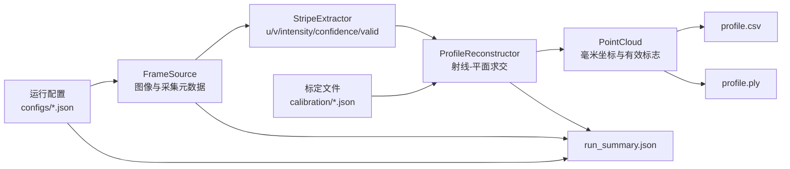

# 线激光静态扫描头最小工程变更说明

- 日期：2026-07-10
- 依据：`final/08线激光静态扫描头研发计划与验收标准.md`
- 变更性质：全新最小工程；未修改已有研发资料
- 验证结论：通过结构闭环测试，可开始迁入旧算法

## 主要改动

1. 建立 `FrameSource`、`StripeExtractor`、`ProfileReconstructor` 三个可替换接口。
2. 固定图像、亚像素中心和三维点的数据模型，三维输出字段统一为 `x_mm,y_mm,z_mm,intensity,confidence,valid`。
3. 提供合成相机、逐列灰度重心和射线-平面求交三个最小参考实现。
4. 提供 JSON 配置、标定版本、配置哈希和运行摘要，支持从原始输入到结果的追溯。
5. 建立 calibration、tuning、validation、blind_test 四类数据目录，防止标定、调参和验收数据混用。
6. 添加 CLI、CSV/PLY 导出和 3 个单元测试，形成可运行闭环。

## 代码流程图

### 图例

- **配置/标定**：版本化输入，不与算法代码混放。
- **蓝色主链路**：采集 → 条纹中心 → 三维轮廓。
- **稳定替换点**：三个接口可分别接入旧相机、旧提取算法和旧重建算法。
- **追溯输出**：保存配置路径、SHA-256、标定版本、机械配置和数据集编号。

## 新增文件分组

- 工程入口：`.gitignore`、`pyproject.toml`、`README.md`
- 配置标定：`configs/demo.json`、`calibration/demo.json`
- 核心契约：`models.py`、`interfaces.py`、`config.py`、`calibration.py`
- 参考实现：`sources/synthetic.py`、`algorithms/centroid.py`、`reconstruction/ray_plane.py`
- 流水线：`bootstrap.py`、`pipeline.py`、`exporters.py`、`cli.py`
- 验证：`tests/test_minimal_pipeline.py`
- 数据骨架：`data/raw/*`、`data/metadata/`、`outputs/`

## 验证结果

| 检查 | 结果 |
|---|---|
| `python -m unittest discover -s tests -v` | 3/3 通过 |
| `python -m line_laser_static --config configs/demo.json` | 通过 |
| `python -m compileall -q src tests` | 通过 |
| 演示输出 | 640/640 有效点，CSV/PLY/摘要均生成 |
| CSV 字段 | 与研发计划约定完全一致 |

## 当前边界与下一步

`calibration/demo.json` 明确标记为 `DEMO_ONLY_NOT_FOR_MEASUREMENT`。当前代码只证明接口和数据流可运行，不能代表精度验收通过。

下一步建议先接入大恒相机 `FrameSource`，用激光关闭/开启的固定原始图验证采集元数据和图像格式；随后接入旧条纹提取算法，最后迁入真实去畸变、激光平面和点云转换代码。每迁入一段，都保留当前合成测试作为回归基线。
