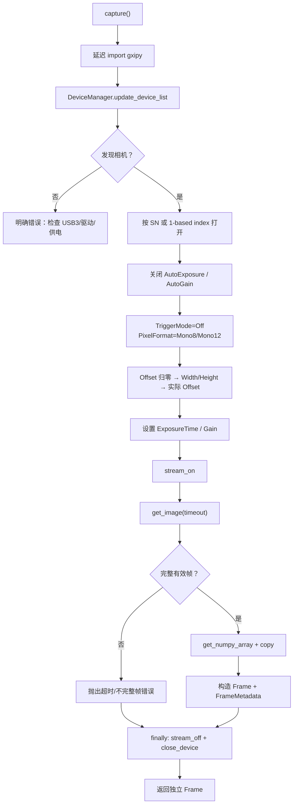

# 大恒 USB3 黑白相机采集适配器详解与使用指南

> 适用相机：大恒 ME2P-1230-23U3M，USB3.0，Mono8/Mono12  
> 采集类：`DahengUsb3FrameSource`  
> 配置文件：`configs/me2p_1230_450nm_daheng_usb3.json`  
> 当前定位：可靠的同步单帧采集适配器，用于“采一帧 → 条纹提取 → 结果输出”  
> 当前真机状态：本机尚未安装 Galaxy SDK / `gxipy`，代码已通过模拟 SDK 测试，但未完成真实相机验证

## 1. 实现了什么

本次新增了一个符合项目 `FrameSource` 接口的大恒 USB3 相机适配器：

```python
FrameSource.capture() -> Frame
```

每次调用 `capture()` 会：

1. 延迟加载大恒 `gxipy`；
2. 枚举相机；
3. 按序列号或设备索引打开相机；
4. 关闭自动曝光和自动增益；
5. 设置自由运行模式、Mono8/Mono12、硬件 ROI、曝光和增益；
6. 启动数据流；
7. 在指定超时内同步获取一帧；
8. 检查不完整帧和空图；
9. 把 SDK 图像复制成独立 NumPy 数组；
10. 读取实际 ROI、曝光和增益写入 `FrameMetadata`；
11. 无论成功、超时还是异常，都尝试停止数据流并关闭设备。

它可以直接接入现有条纹提取流水线：

```text
DahengUsb3FrameSource
    → SensorRoiMonoStripeExtractor
    → RayPlaneReconstructor
    → CSV / PLY / run_summary.json
```

## 2. 为什么先实现同步单帧，而不是连续高速采集？

当前 `StaticProfilePipeline.run_once()` 每次只调用一次 `source.capture()`，因此最小且安全的实现是：

```text
打开相机 → 配置 → 采一帧 → 复制数据 → 停流 → 关闭相机
```

优点：

- 资源生命周期清晰；
- 异常路径也能关闭设备；
- 适合初次验证 USB、SDK、ROI、曝光、像素格式和条纹算法；
- 不需要提前引入线程、回调、队列、丢帧策略和缓冲所有权问题。

限制：

- 每帧重新打开相机，不能用于 15 fps 以上的正式连续采集；
- 暂不支持硬触发、软件触发和回调模式；
- 暂不统计连续帧率和丢帧率。

完成单帧真机验收后，下一阶段应增加“相机保持打开 + 连续取帧 + 有界队列”的会话型采集器，
而不是在当前单帧类中直接堆叠线程逻辑。

## 3. 采集代码流程图



### 图例

- **蓝色主链路**：正常单帧采集路径。
- **判断节点**：没有相机、超时、不完整帧、空数组或非二维 Mono 图都会失败。
- **资源清理链路**：所有打开设备后的出口都会进入 `finally` 关闭相机。
- **独立 Frame**：NumPy 数据会复制，不依赖 SDK 内部缓冲区继续存活。

## 4. 输入配置详解

真实相机配置位于：

```text
configs/me2p_1230_450nm_daheng_usb3.json
```

采集部分：

```json
{
  "source": {
    "name": "daheng_usb3",
    "options": {
      "serial_number": null,
      "device_index": 1,
      "width": 4096,
      "height": 512,
      "offset_x_px": 0,
      "offset_y_px": 1244,
      "full_width_px": 4096,
      "full_height_px": 3000,
      "pixel_format": "Mono8",
      "exposure_us": 2000.0,
      "gain_db": 0.0,
      "discovery_timeout_ms": 1000,
      "capture_timeout_ms": 3000
    }
  }
}
```

### 参数表

| 参数 | 单位 | 作用 | 注意事项 |
|---|---:|---|---|
| `serial_number` | - | 按相机序列号打开 | 推荐真机使用；填写后优先于 index |
| `device_index` | - | 按枚举顺序打开 | gxipy 设备索引从 1 开始 |
| `width` | px | 相机硬件 ROI 宽度 | 必须符合相机节点增量要求 |
| `height` | px | 相机硬件 ROI 高度 | 预设 512，用于提高帧率 |
| `offset_x_px` | px | 硬件 ROI 左上角 X | 设置后会读回实际值 |
| `offset_y_px` | px | 硬件 ROI 左上角 Y | 预设 1244 |
| `full_width_px` | px | 完整参考图宽度 | ME2P-1230 为 4096 |
| `full_height_px` | px | 完整参考图高度 | ME2P-1230 为 3000 |
| `pixel_format` | - | `Mono8` 或 `Mono12` | 当前只支持这两种 |
| `exposure_us` | µs | 曝光时间 | 必须大于 0 |
| `gain_db` | dB | 增益 | 建议从 0 dB 开始 |
| `discovery_timeout_ms` | ms | 枚举设备超时 | 默认 1000 |
| `capture_timeout_ms` | ms | 单帧等待超时 | 默认 3000 |

### 序列号配置

第一次只有一台相机时可以使用：

```json
"serial_number": null,
"device_index": 1
```

确认序列号后建议改成：

```json
"serial_number": "相机真实序列号",
"device_index": null
```

这样即使以后连接多台相机，也不会因为枚举顺序改变而打开错误设备。

## 5. 输出 `Frame` 包含什么

成功采集后返回：

```python
Frame(
    image=numpy_array,
    metadata=FrameMetadata(...),
)
```

### `Frame.image`

- Mono8：二维 `uint8`，有效范围通常 0–255；
- Mono12：通常是二维 `uint16` 容器，有效范围 0–4095；
- 数组形状是相机实际输出的 `(Height, Width)`；
- 数组已经复制，不依赖 `raw_image` 和相机数据流缓冲区。

### `FrameMetadata`

| 字段 | 来源 |
|---|---|
| `frame_id` | SDK 原始帧编号，缺失时为 0 |
| `timestamp_ns` | 主机收到并构造 Frame 时的 `time.time_ns()` |
| `width/height` | 实际 NumPy 数组尺寸 |
| `exposure_us` | 相机节点实际读回值 |
| `gain_db` | 相机节点实际读回值 |
| `pixel_format` | 配置的 Mono8/Mono12 |
| `camera_model` | 枚举设备信息中的 `model_name` |
| `serial_number` | 枚举设备信息中的 `sn` |
| `sdk_version` | `gxipy.__version__`，若没有则 `unknown` |
| `offset_x_px/offset_y_px` | 相机节点实际读回值 |
| `full_width_px/full_height_px` | 配置中的完整参考尺寸 |

当前 `timestamp_ns` 是主机时间，不是相机硬件时间戳。正式同步采集时需要单独设计相机时钟、触发和时间戳映射。

## 6. Galaxy SDK 安装前提

官方大恒软件下载页提供 Galaxy Windows SDK，并标明支持 Windows 7/10/11、USB3.0 和 Mercury 2 系列相机：

- [Daheng Imaging 官方软件下载页](https://en.daheng-imaging.com/list-59-1.html)

推荐安装步骤：

1. 从大恒官方页面下载完整的 Galaxy Windows SDK，不要只安装 Runtime SDK；
2. 安装驱动、GalaxyView、开发库和 Python 示例/绑定；
3. 连接相机到主板原生 USB3.x 端口；
4. 用 GalaxyView 确认能枚举设备、预览图像和设置 ROI；
5. 在 SDK 安装目录找到随附的 Python 示例和 `gxipy`；
6. 使用 SDK 实际支持的 Python 解释器运行示例；
7. 在同一解释器中测试 `import gxipy`。

验证命令：

```powershell
python -c "import gxipy; print(gxipy.__file__)"
```

本机当前检查结果：

```text
Python：3.13
Galaxy SDK：未发现
gxipy：未发现
```

因此当前不能假设 Python 3.13 与将要安装的 Windows `gxipy` 兼容。安装 SDK 后，应优先使用厂商示例已经验证的
Python 版本，再决定是否把 VS Code 项目解释器切换到该版本。不要从来源不明的 PyPI 包替代厂商 SDK。

如果 SDK 自带的 `gxipy` 不在默认搜索路径，按照安装后的真实目录配置 `PYTHONPATH`；
不要在未看到安装目录前猜测路径。

## 7. 在 VS Code 中运行真实相机配置

### 7.1 选择能够导入 gxipy 的解释器

在 VS Code 按：

```text
Ctrl + Shift + P
```

选择：

```text
Python: Select Interpreter
```

然后验证：

```powershell
python -c "import sys, gxipy; print(sys.executable); print(gxipy.__file__)"
```

### 7.2 填写相机序列号

编辑：

```text
configs/me2p_1230_450nm_daheng_usb3.json
```

把 `serial_number` 换成真实值，或者首次测试保留 `device_index=1`。

### 7.3 运行一次完整流水线

```powershell
$env:PYTHONPATH="$PWD\src"
python -m line_laser_static --config configs\me2p_1230_450nm_daheng_usb3.json
```

该命令会：

```text
真实 USB3 采一帧
→ 硬件 ROI 坐标恢复
→ 450 nm 条纹提取
→ 占位激光平面求交
→ 输出 CSV / PLY / run_summary.json
```

输出目录：

```text
outputs/me2p-1230-450nm-daheng-usb3/<运行编号>/
```

注意：当前相机内参和激光平面仍是占位值。真实图像的条纹质量摘要可以查看，但三维坐标禁止用于测量。

## 8. 单独采一帧并保存原始图

当前完整流水线不会自动保存原始 `Frame.image`。如果目的是先验证相机和保存无损原始数据，
可以在 VS Code 新建一个临时调试脚本，或者在 Python 交互终端运行：

```python
from dataclasses import asdict
import json
from pathlib import Path

import numpy as np

from line_laser_static.sources import DahengUsb3FrameSource


source = DahengUsb3FrameSource(
    serial_number=None,
    device_index=1,
    width=4096,
    height=512,
    offset_x_px=0,
    offset_y_px=1244,
    full_width_px=4096,
    full_height_px=3000,
    pixel_format="Mono8",
    exposure_us=2000.0,
    gain_db=0.0,
    discovery_timeout_ms=1000,
    capture_timeout_ms=3000,
)

frame = source.capture()

output_dir = Path("outputs/manual-capture")
output_dir.mkdir(parents=True, exist_ok=True)

np.save(output_dir / "frame_000000.npy", frame.image, allow_pickle=False)
(output_dir / "frame_000000.json").write_text(
    json.dumps(asdict(frame.metadata), ensure_ascii=False, indent=2),
    encoding="utf-8",
)

print(frame.image.shape, frame.image.dtype)
print(frame.metadata)
```

建议优先保存 `.npy`：

- 不会像 JPEG 那样引入压缩误差；
- 能保留 Mono12 的 `uint16` 数据；
- 能直接恢复 NumPy 类型和形状。

元数据 JSON 必须与图像同名保存，不能只保存裸图。

## 9. 相机参数设置顺序

适配器使用以下顺序：

```text
ExposureAuto = Off
GainAuto = Off
TriggerMode = Off
PixelFormat = Mono8 或 Mono12
OffsetX = 0
OffsetY = 0
Width = 目标宽度
Height = 目标高度
OffsetX = 目标偏移
OffsetY = 目标偏移
ExposureTime = 目标曝光
Gain = 目标增益
```

先把 Offset 归零，是为了避免旧偏移使新的 Width/Height 超过相机允许范围。

所有节点设置完成后，相机适配器会在取帧后重新读取实际 Offset、曝光和增益。真实 SDK 仍可能因为节点增量、
当前像素格式或固件限制拒绝参数；这类错误会直接抛出，不会悄悄继续。

## 10. 硬件 ROI 与条纹坐标

配置示例：

```text
完整传感器：4096 × 3000
输出 ROI：4096 × 512
OffsetX：0
OffsetY：1244
```

相机返回的 NumPy 图坐标从 `(0,0)` 开始。后续 `SensorRoiMonoStripeExtractor` 会恢复：

```text
u_full = u_roi + OffsetX
v_full = v_roi + OffsetY
```

因此相机采集适配器必须记录实际 Offset，不能只记录请求值。

如果启用 Binning、Decimation、ReverseX 或 ReverseY，上式不再一定成立。当前适配器没有设置这些功能，
真机调试时应在 GalaxyView/UserSet 中确认它们处于关闭或 1×1 状态。

## 11. Mono8 和 Mono12

### Mono8

推荐作为第一阶段：

- 数据量小；
- 相机和主机处理更快；
- 当前阈值预设按 0–255 设置；
- 更容易先完成帧率、ROI 和条纹有效性验证。

### Mono12

切换配置：

```json
"pixel_format": "Mono12"
```

并同步修改提取器：

```json
"sensor_max_value": 4095.0
```

`min_contrast`、`noise_floor` 等灰度阈值必须使用真实 Mono12 图重新标定。

如果 SDK 返回打包字节流而 `get_numpy_array()` 不是二维 `uint16`，当前适配器会拒绝非二维数组。
需要依据随 SDK 示例增加厂商格式转换，不能自行猜测打包布局。

## 12. 错误处理

| 错误 | 触发条件 | 处理建议 |
|---|---|---|
| 无法加载 `gxipy` | SDK 未安装、Python 不兼容、DLL 路径错误 | 先跑厂商 Python 示例和 import 检查 |
| 未发现相机 | USB/驱动/供电/端口异常 | 用 GalaxyView 检查设备 |
| 序列号未发现 | 配置 SN 与设备不一致 | 查看枚举列表并更新配置 |
| device index 越界 | 索引大于设备数 | 使用 SN 或正确的 1-based index |
| 节点不支持/不可写 | 相机型号、状态或设置顺序不允许 | 停止采集，查看 GalaxyView 节点范围 |
| 取帧超时 | 曝光、触发、USB 或超时设置问题 | 确认 TriggerMode=Off，增加 timeout |
| 不完整帧 | USB 传输或缓冲异常 | 更换端口/线缆，降低数据率，检查驱动 |
| 空 NumPy 图 | SDK 转换失败 | 核对 PixelFormat 和 SDK 示例 |
| 返回三维数组 | 实际不是 Mono 输出 | 检查相机型号和 PixelFormat |
| ROI 越界 | Offset + Width/Height 超过完整图 | 重新计算 ROI 并读回节点范围 |

无论发生上述哪种取帧异常，适配器都会尽力执行 `stream_off()` 和 `close_device()`。

## 13. 测试方法

### 13.1 无相机模拟测试

```powershell
$env:PYTHONPATH="$PWD\src"
python -m unittest discover -s tests -p "test_daheng_usb3_source.py" -v
```

覆盖：

- 按序列号打开；
- ROI、曝光、增益、Mono 格式设置；
- 超时参数传递；
- NumPy 深复制；
- 元数据；
- 超时和不完整帧；
- 异常后资源关闭；
- 配置加载不提前导入 `gxipy`。

### 13.2 完整回归

```powershell
$env:PYTHONPATH="$PWD\src"
python -m unittest discover -s tests -v
```

### 13.3 真机最小验收

1. GalaxyView 能看到 ME2P-1230；
2. `python -c "import gxipy"` 成功；
3. 全分辨率 Mono8 单帧成功；
4. 4096×512、OffsetY=1244 单帧成功；
5. NumPy shape/dtype/最大值符合预期；
6. 元数据中的 Width/Height/Offset 与 GalaxyView 一致；
7. 连续执行 100 次单帧命令无设备占用或无法关闭；
8. 保存 `.npy` 后重新加载，数据完全一致；
9. 条纹叠加到完整图坐标位置正确；
10. 再进入连续采集开发。

## 14. 当前边界

### 已实现

- Galaxy SDK 延迟导入；
- USB3 相机枚举和选择；
- Mono8/Mono12；
- 曝光、增益和自由运行；
- 单硬件 ROI；
- 同步单帧超时；
- 不完整帧/空图/非 Mono 检查；
- NumPy 深复制；
- FrameMetadata；
- 无论异常与否关闭设备；
- 配置和模拟 SDK 测试。

### 尚未实现

- 在本机安装/验证 Galaxy SDK；
- 真实 ME2P-1230 USB3 取帧；
- 相机节点最小值、最大值和增量的主动查询；
- 连续会话和回调采集；
- 有界队列与丢帧策略；
- 外触发/软件触发；
- 硬件时间戳同步；
- 自动原始图归档；
- Mono12 Packed 专用转换；
- 设备断线自动恢复；
- 多相机同步。

## 15. 相关文件

| 文件 | 作用 |
|---|---|
| `src/line_laser_static/sources/daheng_usb3.py` | 大恒 USB3 单帧适配器 |
| `src/line_laser_static/sources/__init__.py` | 导出适配器 |
| `src/line_laser_static/bootstrap.py` | 根据 `daheng_usb3` 配置构造采集源 |
| `configs/me2p_1230_450nm_daheng_usb3.json` | ME2P-1230 真实 USB3 起始配置 |
| `tests/test_daheng_usb3_source.py` | 模拟 gxipy 测试 |
| `src/line_laser_static/algorithms/sensor_roi.py` | 硬件 ROI 坐标恢复与条纹提取 |
| `reports/450nm_mono_sensor_roi_extraction_guide.md` | 硬件 ROI 算法详解 |

## 16. 推荐下一步

1. 安装官方 Galaxy Windows SDK；
2. 用 GalaxyView 记录相机真实序列号、可用 PixelFormat 和 ROI 增量；
3. 选择能够稳定导入 `gxipy` 的 VS Code Python；
4. 运行全图单帧；
5. 运行硬件 ROI 单帧；
6. 保存 20 张激光关闭和 50 张激光开启 `.npy`；
7. 验证条纹提取质量；
8. 再实现相机保持打开的连续采集会话。

## 17. 参考资料

- [Daheng Imaging 官方软件下载页：Galaxy Windows SDK，支持 USB3.0 和 Mercury 2](https://en.daheng-imaging.com/list-59-1.html)
- [大恒 ME2P-U3 系列资料：支持自定义 ROI，降低分辨率可提高帧率](https://www.daheng-imaging.com/uploadfile/2022/1103/20221103021652138.pdf)
- [EMVA GenICam SFNC：Width、Height、OffsetX、OffsetY 的标准定义](https://www.emva.org/wp-content/uploads/GenICam_SFNC_2_3.pdf)

最终 API、枚举名称和 Python 兼容范围，应以你安装的 Galaxy Windows SDK 随附文档和示例为准。
